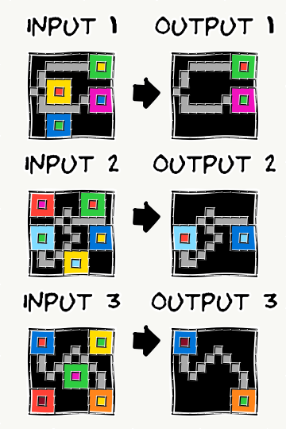

\appendix

## Appendix

### ARC-AGI-2 Task Example

The figure below shows all three training pairs and the test input from task `3dc255db`.^[https://arcprize.org/play?task=3dc255db] A human might interpret the shapes as "spaceships": colored particles sit inside each ship on the exhaust side, and the transformation removes them from the interior and places them on the nose, extending the ship in its direction of travel. The solver must infer this rule --- identifying containment, directionality, and the interior/exterior distinction --- from only three training demonstrations, then apply it to the unseen test input (bottom row). This task remains unsolved by the solver described in this paper: all 29 candidates failed.


### Image Rendering Example

The figure below shows an example of the intentionally imprecise image rendering used for image-based prompting. Each training pair is shown as an input/output image pair, with the test input at the bottom. The slight distortion encourages models to reason about shapes and spatial relationships at a higher level of abstraction rather than falling back to cell-by-cell numerical processing.



### Candidate Configuration Details

Table 6 shows the full candidate configuration. The text family contributes 8 candidates (including 4 deep-think runs), image contributes 10, and code contributes 11. Within each family, multiple runs of the same generator use the same prompt and API parameters; diversity arises from model sampling stochasticity.

| Family | Generator | Candidates |
| --- | --- | --- |
| Text | Claude Opus 4.5 (text) | 1 |
| Text | Gemini 3 Preview (text) | 1 |
| Text | GPT-5.2 (text) | 2 |
| Text | GPT-5.2 (deep think) | 4 |
| Image | Gemini 3 Preview (image) | 4 |
| Image | GPT-5.2 (image) | 6 |
| Code | Gemini 3 Preview (code, tools) | 2 |
| Code | GPT-5.2 (code, tools) | 9 |
| | **Total** | **29** |

: Candidate configuration: 29 generators grouped by family.

### Text Prompting Details

The base prompt is intentionally minimal:

```text
You are solving an ARC (Abstraction and Reasoning Corpus)
task. Each grid cell is an integer 0-9 representing a color.
Use the solved examples to infer the transformation and
apply it to the test input.
...
{training and test examples}
...
Respond with an explanation of your thinking that is detailed
enough that someone can reconstruct your solution. Afterwards,
you MUST also respond with the completed output grid.
```

The prompt deliberately does **not** prescribe a fixed reasoning template, a step-by-step plan, or a fixed output grid format. This reduces "prompt compliance" overhead and empirically increases hypothesis diversity. The trade-off is that outputs are noisier and require tolerant parsing and validation to recover candidate grids (see Section 6 for supporting negative results on strict output constraints).

Grids are encoded in **CSV format**, which was selected after benchmarking 9 representation formats (standard space-separated, semicolon-delimited, XML-tagged, CSV, Python lists, sparse coordinate notation, ASCII symbols, binary masks, and compact pipe-delimited). Suboptimal format choices cost on the order of 10% lost performance relative to CSV, with compact formats that are difficult for LLMs to produce (e.g., sparse coordinate notation, binary masks) performing substantially worse.

### Code Generation Trace Example

The tool-integrated code generation regime often produces rich intermediate artifacts (program drafts, test harnesses, and execution traces) that are later consumed by the holistic judge. A shortened excerpt of the tool-integrated trace illustrates the iterative development pattern:

```text
"detailed_logs": [
  {
    "type": "code",
    "code": "import numpy as np, collections,
             itertools, math, sys, statistics\n",
    "language": "python"
  },
  ...
  {
    "type": "code",
    "code": "# Display expected outer right region
             # values for rows0-19 cols9-19
             outer_expected = ex1_out[:,9:20]
             outer_pred = pred1[:,9:20]
             outer_in = ex1_in[:,9:20]
             outer_expected.shape\n",
    "language": "python"
  },
  ...
  {
    "type": "code",
    "code": "# Let's craft final version and re-test.
             import numpy as np
             from collections import Counter, deque

             def solver(input_grid):
                 g = np ...\n",
    "language": "python"
  },
  {
    "type": "text",
    "content": "### FINAL SOLUTION ###
               import numpy as np
               from collections import Counter, deque

               def solver(input_grid):
                   g = np.array(input_grid, ...)
                   h, w = g ..."
  }
]
```

### Judge Prompt Structure

The holistic judge prompt is assembled programmatically and follows this structure (condensed; the full implementation is in the released source code [anonymized for review]):

```text
Below is a problem that was attempted to be solved {N} times:

{training pairs + test input}

Solutions were generated {N} times, using different types of solvers.

<SOLUTION 1 START>
<CONTENT>
{full reasoning trace or extracted solver function}
</CONTENT>
<PREDICTED_GRID>
{candidate output as CSV}
</PREDICTED_GRID>
<SOLUTION 1 STOP>

... (repeated for all N solutions) ...

Your task is to understand these solutions, and assess how well they've
understood the problem, and how likely their solutions are to provide the
correct solution to the test input.

Often, new mechanics are introduced in the test example for which the
solutions do not generalize well. Please output two solutions that you
think represent the right mechanic for solving the problem.

Output your two solutions as grids (in code blocks). Explain how you
came to these two solutions being the two most likely. Study all the
provided solutions and their reasoning to come up with a meta-conclusion
about how to solve the problem.
```

Each candidate's `CONTENT` block contains the full reasoning trace --- for text/image candidates this is the model's chain-of-thought response, and for code candidates it is the complete iterative tool-use trace including intermediate program drafts, execution outputs, and debugging steps. Candidates that produce identical output grids are listed as separate solutions (with separate traces), preserving the judge's ability to assess reasoning quality even when outputs agree.

### Failure Analysis: Generation Failures (21 instances)

The following instances have zero correct candidates across all modalities (with full 29-candidate coverage):

| Task | Test | Link |
| --- | --- | --- |
| `21897d95` | 1 | https://arcprize.org/play?task=21897d95 |
| `2b83f449` | 1 | https://arcprize.org/play?task=2b83f449 |
| `3a25b0d8` | 1 | https://arcprize.org/play?task=3a25b0d8 |
| `3dc255db` | 1 | https://arcprize.org/play?task=3dc255db |
| `4c416de3` | 1 | https://arcprize.org/play?task=4c416de3 |
| `4e34c42c` | 2 | https://arcprize.org/play?task=4e34c42c |
| `5545f144` | 1 | https://arcprize.org/play?task=5545f144 |
| `6ffbe589` | 1 | https://arcprize.org/play?task=6ffbe589 |
| `88e364bc` | 1 | https://arcprize.org/play?task=88e364bc |
| `8b7bacbf` | 1 | https://arcprize.org/play?task=8b7bacbf |
| `8b7bacbf` | 2 | https://arcprize.org/play?task=8b7bacbf |
| `9bbf930d` | 1 | https://arcprize.org/play?task=9bbf930d |
| `a25697e4` | 1 | https://arcprize.org/play?task=a25697e4 |
| `abc82100` | 1 | https://arcprize.org/play?task=abc82100 |
| `b9e38dc0` | 1 | https://arcprize.org/play?task=b9e38dc0 |
| `d35bdbdc` | 2 | https://arcprize.org/play?task=d35bdbdc |
| `da515329` | 1 | https://arcprize.org/play?task=da515329 |
| `de809cff` | 1 | https://arcprize.org/play?task=de809cff |
| `e12f9a14` | 1 | https://arcprize.org/play?task=e12f9a14 |
| `e12f9a14` | 2 | https://arcprize.org/play?task=e12f9a14 |
| `faa9f03d` | 1 | https://arcprize.org/play?task=faa9f03d |

### Failure Analysis: Selection Failures (17 instances)

The following instances have at least one correct candidate, but the holistic judge fails to select it:

| Task | Test | Link |
| --- | --- | --- |
| `16b78196` | 1 | https://arcprize.org/play?task=16b78196 |
| `35ab12c3` | 1 | https://arcprize.org/play?task=35ab12c3 |
| `36a08778` | 2 | https://arcprize.org/play?task=36a08778 |
| `4c7dc4dd` | 1 | https://arcprize.org/play?task=4c7dc4dd |
| `4e34c42c` | 1 | https://arcprize.org/play?task=4e34c42c |
| `6e4f6532` | 1 | https://arcprize.org/play?task=6e4f6532 |
| `7666fa5d` | 1 | https://arcprize.org/play?task=7666fa5d |
| `78332cb0` | 1 | https://arcprize.org/play?task=78332cb0 |
| `78332cb0` | 2 | https://arcprize.org/play?task=78332cb0 |
| `7b80bb43` | 1 | https://arcprize.org/play?task=7b80bb43 |
| `88bcf3b4` | 2 | https://arcprize.org/play?task=88bcf3b4 |
| `89565ca0` | 1 | https://arcprize.org/play?task=89565ca0 |
| `9aaea919` | 1 | https://arcprize.org/play?task=9aaea919 |
| `a32d8b75` | 1 | https://arcprize.org/play?task=a32d8b75 |
| `d35bdbdc` | 1 | https://arcprize.org/play?task=d35bdbdc |
| `e3721c99` | 2 | https://arcprize.org/play?task=e3721c99 |
| `eee78d87` | 1 | https://arcprize.org/play?task=eee78d87 |

### Judge Transcript Examples

#### Minority recovery: `dfadab01:1`

This instance heavily suffers from "group think": 12 of the candidate solvers converge on the same incorrect output, and another 8 converge on a second incorrect output. Only one candidate solver produces the correct output. The judges identify the originality in this lone solution and select it:

```text
Most candidate solvers correctly identify the
core stamp mechanic:
...
I prefer solutions that do *not* stamp at (9,8)
(e.g., solutions 10-15/17-20) over those that
stamp every 8.

The only remaining ambiguity is edge handling
(not clearly disambiguated by the training set):
- Some solvers assume a stamp must fit fully
  (ignore row 17 markers).
- Others assume stamps are clipped at the border
  (row 17 markers produce the top 3 rows of
  the tile).

So the two most plausible outputs
(same mechanic, differing only in border handling)
```

The judge correctly identifies that the core mechanic is not in dispute and reasons that the real ambiguity lies in edge handling. Rather than committing both guesses to the majority interpretation, the judge uses the pass@2 format to hedge: it selects one output for each interpretation of the border behavior.

#### Synthesis example: `21897d95:2`

This is a particularly difficult task where **none** of the 29 candidates produced a correct output. The judge synthesized a correct output by recombining partial insights from multiple flawed candidates:

```text
--- COUNCIL OF JUDGES SYNTHESIZED SOLUTION ---
Across the training examples, the only solutions that
consistently match the *actual* structure are SOLUTION 1
and SOLUTION 2 (they are the same). They correctly
identify the key mechanic:

- The input is divided into large "rooms" (rectangular
  regions of a dominant background color).
- Inside rooms, color 1 forms a 4-cell T-shape arrow
  (a 3-long bar + 1-cell stem).
- The stem direction indicates which neighboring room
  is the target.
- The paint color is:
  - the center of the 3-long bar if it is not 1
    (a payload color), otherwise
  - the background color of the room containing
    the arrow.
...
the same room recoloring but then rotated 90 CCW.
This is much less likely given the square training
examples, but it matches the extra rotation behavior
seen in the non-square examples and is the most
plausible "geometry variant" if a solver applied
that step unconditionally
...
```

### Selection Failure Examples

**`36a08778`** (test 2): The training examples establish a straightforward "water flows downward" mechanic. Test 2 introduces walls that block flow --- a new structural element not present in training. Most candidates (and the judge) converge on the simpler mechanic:

```text
Most of the 29 solvers converged to the *same* mechanic (and the same output)
...
I discarded outliers like **Solution 2** and **Solution 1**
```

**`88bcf3b4`** (test 2): Training examples show a single "rope/snake" component moving in one direction. Test 2 introduces multiple strings moving in multiple directions. The judge identifies the ambiguity but cannot resolve it:

```text
From the 5 training examples, the consistent mechanic is **not** "gravity" or
"attraction" of whole blobs. Instead, one non-background component acts like a
**rope/snake**
...
The main ambiguity the examples do *not* disambiguate is what happens when the
"returning" segment reaches the pole's column/row again
```

### Candidate Generation Cost by Modality

| Modality family | Total ($) | Avg $/instance | % of generation cost |
| --- | --- | --- | --- |
| Text (incl. deep think) | 597.70 | 3.58 | 28.7% |
| Image | 467.10 | 2.80 | 22.5% |
| Code | 1016.56 | 6.09 | 48.9% |

: Candidate generation cost by modality family.

### Modality Ablations (Oracle-Level)

Section 4 reports modality-level uniqueness on the **complete-coverage subset** (n = 130), where all modalities are executed. In this subset, the following **exclusive** oracle solvability counts are observed (Table 3): Text only = 2, Image only = 6, Code only = 7. These exclusive counts imply that removing any single modality would reduce candidate-oracle coverage by at least a few percent.

However, oracle-level analysis has an important limitation: it measures whether a correct candidate *exists* in a modality's output, but does not measure the end-to-end effect of removing that modality on the final system output. Removing a modality could affect judge behavior in ways not captured by oracle overlap --- for instance, reducing the number of candidates changes cluster dynamics, which could make it easier or harder for the holistic judge to identify the correct solution.

The proper ablation --- running the full pipeline with one modality family removed and re-running judging on the reduced candidate pool --- has not been performed. The oracle-level uniqueness numbers should be interpreted as a lower bound on each modality's contribution, not as a precise end-to-end attribution.

### Unperformed Ablations

The following ablations would strengthen the paper's claims but have not been run due to cost constraints.

**Generation ablations:**

- **End-to-end modality removal:** run the full pipeline with one modality family removed and re-run judging on the reduced candidate pool. This requires at minimum three full runs (~$7,200 total).
- **Independent candidates vs sequential refinement:** hold compute fixed and compare N independent candidates against N sequential refinement steps.
- **Candidate budget scaling:** sweep the number of candidates per modality/model to estimate marginal returns per additional candidate.
- **Per-model contribution:** isolate the contribution of each foundation model by running the pipeline with one model removed entirely.
- **Temperature and sampling parameters:** sweep temperature, top-p, and other sampling parameters within each modality.
- **Representation formats:** CSV vs alternative encodings, evaluated under the same candidate/judge budgets.

**Selection and judging ablations:**

- **Full majority-vote baseline comparison:** run majority vote as the sole selection mechanism in a full end-to-end run.
- **Judge ensemble sizing:** compare 1-judge vs 3-judge accuracy.
- **Alternative selection mechanisms:** compare against per-output log-probability scoring, pairwise tournaments, and best-of-N with a reward model.
- **Judge model diversity:** rigorously compare homogeneous vs mixed-model judge ensembles.
- **Trace content ablation:** compare judge accuracy with traces vs outputs-only.

**Early stopping ablations:**

- **Early stopping threshold tuning:** vary the agreement threshold and the number of candidates consulted before the stopping decision.

### Negative Results: Full Details

#### Hint generation followed by solver (discarded)

This approach is structurally similar to iterative self-improvement methods such as Self-Refine [@madaan2023selfrefine] and Reflexion [@shinn2023reflexion]. The hint stage often **limits creativity** and collapses candidate diversity into a narrower space, which is counterproductive when trying to break new ground.

#### Object identification followed by transformation identification followed by solver (discarded)

Structured decomposition to "force" abstraction. Failure mode: brittle handoff between stages. Both verbose and overly terse handovers caused confusion and reduced diversity, often regressing toward the mean rather than expanding the hypothesis space.

#### Opus codegen and Opus image reasoning (discarded from final mix)

Opus contributes only a single text-reasoning candidate in the final system. Opus codegen and image reasoning were tested but contributed less uniquely relative to the GPT/Gemini configurations.

#### Grid representations and output constraints (discarded variants)

CSV-style encoding outperformed many alternatives, especially as grids grow. Forcing strict outputs (e.g., requiring JSON via API-level response formats) underperformed. Removing constraints increases output noise; robust parsing (regex + validation) becomes necessary, but was worth it for accuracy.

#### Synthetic data augmentation for code candidates (discarded)

Surface-level augmentations (color permutation) add little signal. Geometric transforms (rotation, mirroring) break semantics for orientation-dependent tasks. Meaningful augmentation requires solving the task first --- making it infeasible in a private-dataset evaluation setting.

#### Extensive prompt engineering (discarded)

The more prescriptive the prompt, the worse the system performed on the hardest tasks. The mechanism appears to be a **compliance tax on reasoning**: when the model is given detailed instructions about *how* to think, it allocates reasoning budget to following those instructions rather than to actually solving the problem. Tested strategies included prescribed reasoning templates, structured output requirements, detailed chain-of-thought scaffolding, domain-specific heuristics in the prompt, and iterative prompt refinement. In every case, the final minimal prompt outperformed.

This also interacts with diversity: a prescriptive prompt narrows the hypothesis space across candidates. When all N candidates follow the same reasoning template, they tend to converge on the same (possibly wrong) answer.

