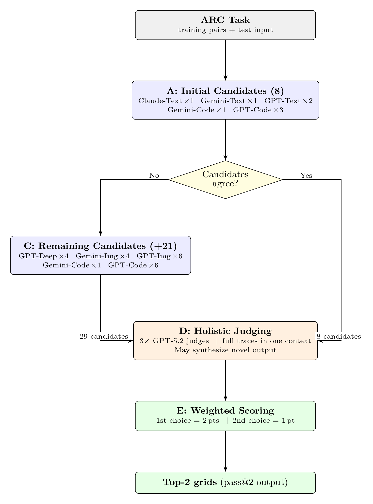

## Introduction

A central challenge in applying LLMs to abstract reasoning is not just producing candidate solutions, but **knowing what is right and what is wrong** in a setting where models can be confidently incorrect --- even when they provide detailed, plausible reasoning traces. ARC-AGI-2 [@arcprize2024report] was designed to be *easy for humans and hard for AI*, and --- critically --- to measure both **capability** and **efficiency** (cost).

This paper describes an approach that treats **modalities as search operators** and uses **judging as the final selection mechanism**: generate diverse candidate solutions across independent reasoning channels (text, image, and code with tool-use), then select among them using a context-preserving holistic judge that reads all candidate traces jointly. Unlike standard self-consistency (majority vote) or per-candidate scoring, this judge identifies correct *minority* hypotheses by comparing full reasoning traces in a single context window --- yielding +7 solved instances over majority vote at only 13% of total system cost.

On the ARC Prize semi-private evaluation set, this solver achieves **72.9%** at $38.99/task --- the highest score on the ARC-AGI-2 Verified leaderboard at the time of submission, exceeding the next-best entry by +18.7 percentage points. On the public evaluation set, it achieves **76.11%** at $19.69/task (self-measured). The full source code and public-evaluation run data are released.^[Anonymized for review.] This paper also documents negative results showing which common prompting and decomposition strategies reduced diversity and hurt performance.


## Background and Related Work

### ARC-AGI as a benchmark for abstraction

The Abstraction and Reasoning Corpus (ARC) was introduced by @chollet2019measure as part of a broader argument for measuring intelligence as **skill-acquisition efficiency**. ARC tasks are framed as **few-shot input--output induction**: given a handful of training demonstrations (pairs of grids), the solver must infer an underlying transformation rule and apply it to a held-out test input. The hallmark difficulty is **underspecification**: multiple hypotheses can explain the training pairs, but only a subset will transfer to the test instance. An illustrative task example is provided in the appendix.

ARC-AGI-2 [@arcprize2024report] is a second-generation benchmark with calibrated public, semi-private, and private evaluation splits (120 tasks each), designed to reduce susceptibility to brute-force program search and provide a wider useful range of scores. Evaluation uses **pass@2** scoring (two guesses permitted per test instance), and ARC Prize emphasizes not just raw accuracy but also **efficiency** (cost per task).

### Related work

**Classical ARC solvers** treat tasks as latent programs composed from a hand-designed DSL, relying on enumerative search over transformation chains [@ferre2021arc]. These systems established that search can compensate for weak learned priors, and motivated ARC-AGI-2's design to be "less brute-forcible."

**Learned and hybrid approaches** include transduction-based methods (directly predicting test outputs) and induction-based methods (inferring latent programs). @li2024induction show that combining induction and transduction can approach human-level performance on the original ARC under their experimental setup. Other notable approaches include latent program search [@bonnet2024latent], neurally-guided program induction [@ouellette2024neurally], small transformer models [@fletcherhill2024miniarc], and 2D nGPT architectures [@puget2024nGPT]. Benchmark extensions such as ConceptARC [@moskvichev2023conceptarc], ARC-GEN [@moffitt2025arcgen], and Re-ARC [@hodel2024rearc] address data limitations.

**Test-time compute scaling** has become a major theme in ARC solving. Chain-of-thought prompting [@wei2022chain] showed that eliciting step-by-step reasoning improves performance on complex tasks. @snell2024scaling show that optimally allocating test-time compute can be more effective than scaling model parameters. @akyurek2024surprising demonstrate that updating model parameters at test time yields strong gains on ARC-like reasoning. Self-consistency [@wang2022selfconsistency] demonstrated that sampling multiple reasoning paths and selecting the most consistent answer outperforms single-trace inference. Tree of Thoughts [@yao2023tree] and Graph of Thoughts [@besta2024graph] reframe inference as explicit search over intermediate reasoning units.

**Tool-augmented reasoning** --- ReAct [@yao2022react], PAL [@gao2023pal], Toolformer [@schick2023toolformer] --- is directly relevant to ARC, where code synthesis serves both as a hypothesis generator and as a source of structured intermediate artifacts for downstream selection. Iterative refinement methods (Self-Refine [@madaan2023selfrefine], Reflexion [@shinn2023reflexion]) trade tokens for improved outputs but risk anchoring to early hypotheses.

**LLM-as-a-judge** paradigms [@zheng2023judging] delegate selection to LLM evaluators, showing strong correlation with human preferences alongside systematic biases (position, verbosity). For ARC in particular, selection is unusually difficult because many hypotheses fit the demonstrations yet fail on the test instance.

### Positioning of this work

This approach combines three trends: (1) **hypothesis generation as explicit search** across *multiple reasoning modalities* rather than a single representation, (2) **tool-mediated reasoning** producing richer intermediate artifacts for downstream selection, and (3) **judge-based selection** adapted for ARC's specific challenge of judging *generalization under underspecification*. The distinctive element is combining heterogeneous candidate generators with context-preserving comparison over full traces, rather than scalar scoring or consensus compression.


## Method

### Core idea: modalities as search operators

The solver is built around a practical observation: to solve tasks that frontier systems *do not already solve*, the correct solution is often a **minority hypothesis**. Therefore, the solver intentionally creates many *independent* candidate solutions across heterogeneous reasoning modalities (text, image, and code), maximizing the probability that at least one candidate captures a genuinely novel hypothesis. Each modality provides a structurally different representation of the same task, which empirically produces candidates that cluster differently (Section 4).

### Pipeline overview

Figure 1 shows the end-to-end pipeline. For each ARC task:



1. **Candidate generation (up to 29 candidates).** Run modality-specific solvers across text, image, and code reasoning channels. Each candidate produces one output grid and a reasoning trace; for code candidates, this includes iterative tool calls and execution logs. If early-stage candidates show strong agreement, the system terminates early and skips remaining modalities (adaptive early stopping).

2. **Holistic judging (3 parallel judges).** Concatenate all candidate traces into a single long-context prompt (30k--80k tokens) and ask a judge model to identify the top-2 most likely correct candidates (or propose a synthesis), explain why other clusters are wrong, and output the final grids.

3. **Weighted scoring.** Each judge's first choice receives 2 points and second choice receives 1 point. The two distinct output grids with the highest total score become the solver's pass@2 guesses.

### Candidate generation

Candidate generation uses three foundation models --- **Gemini 3 Preview**, **GPT-5.2**, and **Claude Opus 4.5** --- across three modality families. The full configuration (29 generators; see appendix for details) groups candidates as follows:

- **Text (8 candidates):** Standard text prompting with a minimal prompt (see appendix) across multiple models, plus a "deep think" configuration that allocates a larger reasoning budget. The prompt deliberately avoids prescribed reasoning templates to maximize hypothesis diversity.
- **Image (10 candidates):** Grids are rendered as annotated images alongside the instruction prompt (example rendering in the appendix). Renderings are intentionally **imprecise** --- slightly distorted rather than pixel-perfect --- because imprecision empirically encourages models to reason about shapes and spatial relationships at a higher level of abstraction rather than falling back to cell-by-cell numerical reasoning.
- **Code (11 candidates):** Program synthesis via two regimes: (i) *tool-integrated* code generation with iterative sandbox execution and debugging, and (ii) *one-shot* code generation without execution feedback. Tool-integrated generation produces rich intermediate artifacts consumed by the holistic judge.^[The ARC Prize semi-private evaluation uses OpenAI's zero-data-retention (ZDR) API mode, which disables tool calls. For that run, tool-integrated candidates were replaced with one-shot code generation.]

### Holistic judging

The key insight is that **having all context together beats abstracting traces into scores**. Three alternative judging approaches were tested:

1. **Logic judge (failed):** scoring candidates by reasoning consistency. Failure mode: candidates can be "logical" yet overfit to training pairs.
2. **Consistency judge (partial):** rewarding themes that repeat across candidates. Failure mode: rewards the majority cluster, but the correct solution on hard tasks is often a minority hypothesis.
3. **Holistic judge (final):** providing *all traces together* and asking the judge to pick the top-2 candidates. This lets the judge detect subtle but decisive differences between near-identical hypotheses.

The holistic judge can be understood as an **anti-consistency** mechanism: it is designed to override the plurality answer when trace-level reasoning suggests a minority candidate better generalizes to the test instance. Self-consistency [@wang2022selfconsistency] selects the most common answer --- effective when the majority is correct. On ARC-AGI-2, the majority is often *wrong* on the hardest tasks, making consistency-based selection a liability.

All three judges use **GPT-5.2** (x-high reasoning). A mixed-model ensemble was tested but three homogeneous GPT-5.2 judges outperformed the mixed configuration. The judge prompt (detailed in the appendix) provides all candidate traces and outputs, and asks for a "meta-conclusion" without instructing the judge to prefer majority or minority answers. Each candidate's content block contains the full reasoning trace --- for text/image candidates, the chain-of-thought response; for code candidates, the complete iterative tool-use trace including intermediate program drafts, execution outputs, and debugging steps.

**Synthesis.** The judge may also propose a **novel solution** not identical to any candidate output, recombining correct subcomponents of multiple flawed candidates. This matters on tasks where no single candidate is fully correct but multiple candidates contain partial truths.

**Known limitations.** Candidate order is not shuffled between judge runs, which could introduce position bias. The judge may also exhibit verbosity and format biases [@zheng2023judging]. No debiasing is applied in the current implementation.


## Experiments and Results

### Evaluation setup

ARC-AGI-2 provides multiple evaluation sets evaluated under **pass@2** [@arcprize2024report]. ARC Prize Verified results are reported on the **semi-private evaluation set** via an official verification process. The solver was iteratively designed using the training set and public evaluation set; the semi-private evaluation was run on held-out tasks unseen during development. The same system also achieved 94.5% on ARC-AGI-1's semi-private evaluation with no ARC-AGI-1 exposure during design.^[ARC-AGI-1 result verified via the ARC Prize evaluation infrastructure: https://arcprize.org/leaderboard]

**Metrics.** (i) **Accuracy (pass@2)**: the mean per-task solve rate, where each task's rate is the fraction of its test instances answered correctly within two guesses. (ii) **Cost per task**: total runtime API cost divided by number of tasks.

### Headline results

The solver was submitted on December 15, 2025, with results announced February 3, 2026.

- **Semi-private (official):** 72.9% at $38.99/task.
- **Public eval (self-measured):** 76.11% at $19.69/task.

| AI System | ARC-AGI-2 | Cost/Task |
| --- | --- | --- |
| Human Panel | 100.00% | $17.00 |
| This paper | 72.90% | $38.99 |
| This paper (public eval) | 76.11% | $19.69 |
| GPT-5.2 Pro (High) | 54.20% | $15.72 |
| Gemini 3 Pro (Refine.) | 54.00% | $30.57 |
| GPT-5.2 (X-High) | 52.90% | $1.90 |
| Gemini 3 Deep Think | 45.10% | $77.16 |

: Leaderboard snapshot and reference systems. Semi-private results are from the ARC Prize Verified leaderboard at the time of announcement.

At the time of submission, this was the **highest score on the ARC-AGI-2 Verified leaderboard**, exceeding the next-best entry (GPT-5.2 Pro at 54.2%) by +18.7 percentage points. This indicates that modality-driven candidate generation combined with long-context judging can substantially move the frontier beyond what individual commercial systems achieve. The ~3 pp gap between public (76.11%) and semi-private (72.9%) likely reflects several compounding factors: natural generalization loss to held-out tasks, the ZDR API constraint disabling tool calls (forcing one-shot code generation), API instability during the semi-private run (84% GPT-5.2 failure rate reducing candidate coverage), and potentially fewer early-stopping triggers on harder tasks (reducing the cost savings that lower the per-task average on easier distributions).

**Temporal nature of results.** The ARC-AGI-2 leaderboard is evolving rapidly. Foundation models are improving at a pace where single-model performance can increase substantially between model generations. The contribution of this paper is the **architectural pattern** --- modality-driven search paired with context-preserving selection --- rather than the specific accuracy numbers, which are a product of the models available at the time of submission.

### Efficiency

- **Semi-private:** $38.99/task at 72.9%; **Public eval:** $19.69/task at 76.11%.
- At $19.69/task, the solver is comparable to GPT-5.2 Pro ($15.72) while achieving +21.9 pp accuracy (76.11% vs. 54.2%), and is cheaper and substantially more accurate than Gemini 3 Pro ($30.57 at 54.0%).
- The 2x cost difference between semi-private and public runs is primarily caused by API-level unreliability during the semi-private run: only 2,216 of 14,106 GPT-5.2 API attempts succeeded.

### Modality complementarity (public eval)

The public evaluation split contains 120 tasks with 167 test instances. Of these, the system solves **128/167 = 76.65%** at the instance level. The candidate pool contains at least one correct output for **144/167 = 86.23%** of instances (candidate-oracle accuracy). The 39 unsolved instances decompose into 21 generation failures (no correct candidate exists), 17 selection failures (correct candidate exists but is not selected), and 1 early-stopping failure.


The solver uses adaptive early stopping: 37 instances were stopped after 8 candidates, with **36/37 solved correctly** (97.3%). To avoid conflating uniqueness with conditional execution, the modality analysis below uses the 130 instances with complete candidate coverage (29/29 candidates).

| | Text | Image | Code |
| --- | --- | --- | --- |
| Text | NA | 13 | 7 |
| Image | 17 | NA | 11 |
| Code | 18 | 18 | NA |

: Pairwise non-overlap between modality families (n = 130). Each cell reads "row solves, column does not." The table is not symmetric.

| Family | Count |
| --- | --- |
| Text only | 2 |
| Image only | 6 |
| Code only | 7 |

: Exclusive coverage (n = 130).

Tables 2--3 indicate substantial complementarity: each family covers instances that others miss. Instance-level heterogeneity is pronounced --- some tasks are solved reliably by one family while being largely unsolved by others (see the appendix for additional examples).

### Judging and synthesis

**Judge-based selection** yields a net uplift of **+7** instances over a majority-vote baseline. All 7 are **minority recoveries** --- cases where the correct answer was not the majority output. This validates the "anti-consistency" motivation: on these tasks, the majority cluster was wrong, and the judge's trace-level reasoning was the deciding factor (see the appendix for a detailed example).

**Judge synthesis** was invoked 17 times total across all three judges, yielding **+1** additional solved instance --- a task where none of the 29 candidates produced a correct output, but the judge recombined partial insights from multiple flawed candidates to produce a novel correct output (see the appendix for the judge's synthesis rationale).

### Failure analysis

Of the 39 unsolved instances (full task lists in the appendix):

- **21 generation failures** tend to require long chains of dependent reasoning steps where models collapse or shortcut the chain rather than faithfully executing all steps.
- **17 selection failures** often involve test instances that introduce a new mechanic not fully disambiguated by training examples, creating genuine ambiguity that the judge resolves incorrectly by favoring the majority interpretation.
- **1 early-stopping failure** (`dbff022c:1`) is a case of extreme groupthink where all 8 early candidates converge on the same wrong interpretation.


## Ablation Studies

Each full-pipeline run costs approximately $2,400 in API spend (Table 5), making extensive ablation prohibitively expensive. This paper relies primarily on **post-hoc analysis of the single public evaluation run**, extracting what can be measured from existing data rather than running dedicated ablation experiments. This approach cannot capture interaction effects between components; the ablations reported here should be read with this constraint in mind.

### Measured ablations

| Component | Ablation / control | Net uplift (instances) |
| --- | --- | --- |
| Holistic selection | vs. majority-vote baseline | +7 (all minority recoveries) |
| Judge synthesis | Enabled vs. disabled | +1 |

: Measured judge ablations on the public evaluation run.

The +7 holistic selection uplift comes entirely from minority recoveries --- instances where the correct answer was not the most frequent candidate output. The +1 synthesis uplift comes from a task where no single candidate was correct, but the judge recombined partial insights.

### Cost attribution

| Phase | Total ($) | Avg $/instance | % of total |
| --- | --- | --- | --- |
| Candidate generation | 2081.37 | 12.46 | 87.1% |
| Judging | 308.91 | 1.85 | 12.9% |
| **Total** | **2390.28** | **14.31** | **100%** |

: Cost attribution per test instance (n = 167).^[A strict roll-up of $2,390.28 / 120 tasks = $19.92/task differs slightly from the reported $19.69/task; the discrepancy is due to accumulated floating-point rounding in the cost-accounting script.]

Candidate generation dominates overall cost at 87% of spend. Given that judging contributes +7 solved instances (holistic selection) and +1 (synthesis) at only 13% of total cost, the judging phase is highly cost-effective relative to its accuracy contribution. A per-modality cost breakdown is provided in the appendix.

### Modality ablations (oracle-level only)

On the complete-coverage subset (n = 130), exclusive oracle solvability counts are: Text only = 2, Image only = 6, Code only = 7 (Table 3). These imply that removing any single modality would reduce candidate-oracle coverage. However, oracle-level analysis does not capture end-to-end effects of modality removal on judge behavior. The proper ablation --- running the full pipeline with one modality family removed --- has not been performed; the oracle-level numbers should be interpreted as a lower bound on each modality's contribution.

### Unperformed ablations

A detailed list of ablations that would strengthen the paper's claims --- including end-to-end modality removal, candidate budget scaling, judge ensemble sizing, trace content ablation, and early stopping threshold tuning --- is provided in the appendix. These have not been run due to cost constraints (~$7,200+ for the minimum set).


## Negative Results

This section summarizes explored approaches that were ultimately discarded; full details are in the appendix.

**Sequential decomposition** (hint-then-solve, object-then-transform-then-solve) consistently reduced candidate diversity by collapsing the hypothesis space at each handoff stage, counteracting the system's core diversity strategy. **Strict output constraints** (JSON schemas, prescribed reasoning templates) degraded performance on hard tasks through a "compliance tax on reasoning" --- the model allocates reasoning budget to following instructions rather than solving the problem. **Synthetic data augmentation** for code candidates (color permutation, rotation) added little signal because surface-level augmentations do not test new structural properties, and geometric transforms can break task semantics.

The most counterintuitive finding: **the more prescriptive the prompt, the worse the system performed** on the hardest tasks. The final system uses a deliberately minimal prompt (see the appendix) with no prescribed structure, step-by-step template, or domain heuristics. This also interacts with diversity: a prescriptive prompt narrows the hypothesis space across candidates, causing them to converge on the same (possibly wrong) answer. For novel reasoning tasks where the solution is not known in advance, the best prompt is often the least prescriptive one.


## Discussion and Conclusion

This paper demonstrates that strong ARC-AGI-2 performance can be achieved by treating **modalities as search operators** and pairing diverse candidate generation with context-preserving selection: generate candidates independently across heterogeneous reasoning channels (text, image, code), then select using holistic judging over full traces.

### Limitations

**Cost and scalability.** The system spends $19.69--$38.99 per task --- orders of magnitude more expensive than a single model call. Much of the cost is spent on candidates that contribute nothing to the final answer. A production system would need adaptive routing, but no such mechanism has been developed here.

**Single-run results.** The headline numbers each come from a single evaluation run. No confidence intervals are reported because repeated full-pipeline runs were not performed (each costing ~$2,400). The true expected accuracy could be meaningfully higher or lower than the reported figures.

**Incomplete ablation coverage.** The component attribution claims are based on post-hoc analysis of a single run rather than controlled experiments. Several important ablations have not been performed due to cost constraints (see the appendix).

**Reproducibility fragility.** The system depends on specific proprietary model snapshots that may change or become unavailable over time. Full source code and raw data are released^[Anonymized for review.] to maximize reproducibility, but exact replication is not guaranteed.

**No learning across tasks.** The system treats each task independently --- no information is carried from one task to the next, unlike a human solver who would build intuitions across tasks.

**Narrow evaluation domain.** Results are demonstrated on a single benchmark (ARC-AGI-2). While the architectural pattern is domain-general in principle, this paper provides no evidence of transfer to other domains.

### Future work

- **Adaptive routing:** allocate expensive modalities only when uncertainty is high.
- **Judge compression:** reduce context size while retaining the benefits of joint context.
- **Synthesis gating and amplification:** decide *when* synthesis is likely to help, and invoke additional synthesis attempts with varied prompting when high potential is identified.
- **Image representation tuning:** systematic study of rendering parameters and their interaction with different vision-language models.
- **Formal diversity quantification:** richer diversity measures (pairwise disagreement rates, embedding-space distances) to enable principled decisions about generator selection.
- **Domain transfer:** validate the "diverse generation + holistic judging" pattern on non-ARC benchmarks.
- **Further ablations:** the unperformed ablations listed in the appendix would substantially strengthen the paper's claims.

### Conclusion

ARC-AGI-2 progress is moving quickly, and the benchmark is explicitly designed to push beyond what scaling alone yields. This work demonstrates that treating modalities as search operators and selecting via context-preserving holistic judging can substantially exceed the performance of the strongest commercially available LLMs --- achieving 72.9% versus 54.2% for the best single-model baseline, a +18.7 percentage-point improvement. The architectural pattern is simple: **search across modalities, judge in full context.** The results suggest that orchestrating diverse reasoning channels with principled selection is a powerful lever for abstract reasoning, complementary to and currently ahead of gains from scaling individual models alone.

\subsubsection*{Ethics Statement}

This work uses publicly available benchmarks (ARC-AGI-2) and commercial LLM APIs. No human subjects, personal data, or sensitive information are involved. The system's sole purpose is solving abstract reasoning tasks on a research benchmark. The computational cost of this approach (approximately \$2,400 per full evaluation run) is disclosed throughout the paper. All foundation models are accessed via their standard commercial APIs under their respective terms of service.

\subsubsection*{Reproducibility Statement}

The full source code --- including all prompts, tool schemas, candidate generation configurations, and judging logic --- is publicly available.^[Anonymized for review.] The complete public-evaluation run data --- including all API parameters, model versions, and raw logs (prompts, responses, reasoning traces, intermediate artifacts, and judge transcripts; over 7 million lines) --- is also publicly available.^[Anonymized for review.] The semi-private evaluation was executed by the ARC Prize verification infrastructure; the authors do not control that environment and cannot release those logs. Because the system depends on specific proprietary model snapshots (GPT-5.2, Gemini 3 Preview, Opus 4.5) that may change over time, exact numerical replication is not guaranteed even with identical code and parameters.


\appendix

## Appendix

### ARC-AGI-2 Task Example

The figure below shows all three training pairs and the test input from task `3dc255db`.^[https://arcprize.org/play?task=3dc255db] A human might interpret the shapes as "spaceships": colored particles sit inside each ship on the exhaust side, and the transformation removes them from the interior and places them on the nose, extending the ship in its direction of travel. The solver must infer this rule --- identifying containment, directionality, and the interior/exterior distinction --- from only three training demonstrations, then apply it to the unseen test input (bottom row). This task remains unsolved by the solver described in this paper: all 29 candidates failed.


### Image Rendering Example

The figure below shows an example of the intentionally imprecise image rendering used for image-based prompting. Each training pair is shown as an input/output image pair, with the test input at the bottom. The slight distortion encourages models to reason about shapes and spatial relationships at a higher level of abstraction rather than falling back to cell-by-cell numerical processing.


### Candidate Configuration Details

Table 6 shows the full candidate configuration. The text family contributes 8 candidates (including 4 deep-think runs), image contributes 10, and code contributes 11. Within each family, multiple runs of the same generator use the same prompt and API parameters; diversity arises from model sampling stochasticity.

| Family | Generator | Candidates |
| --- | --- | --- |
| Text | Claude Opus 4.5 (text) | 1 |
| Text | Gemini 3 Preview (text) | 1 |
| Text | GPT-5.2 (text) | 2 |
| Text | GPT-5.2 (deep think) | 4 |
| Image | Gemini 3 Preview (image) | 4 |
| Image | GPT-5.2 (image) | 6 |
| Code | Gemini 3 Preview (code, tools) | 2 |
| Code | GPT-5.2 (code, tools) | 9 |
| | **Total** | **29** |

: Candidate configuration: 29 generators grouped by family.

### Text Prompting Details

The base prompt is intentionally minimal:

```text
You are solving an ARC (Abstraction and Reasoning Corpus)
task. Each grid cell is an integer 0-9 representing a color.
Use the solved examples to infer the transformation and
apply it to the test input.
...
{training and test examples}
...
Respond with an explanation of your thinking that is detailed
enough that someone can reconstruct your solution. Afterwards,
you MUST also respond with the completed output grid.
```

The prompt deliberately does **not** prescribe a fixed reasoning template, a step-by-step plan, or a fixed output grid format. This reduces "prompt compliance" overhead and empirically increases hypothesis diversity. The trade-off is that outputs are noisier and require tolerant parsing and validation to recover candidate grids (see Section 6 for supporting negative results on strict output constraints).

Grids are encoded in **CSV format**, which was selected after benchmarking 9 representation formats (standard space-separated, semicolon-delimited, XML-tagged, CSV, Python lists, sparse coordinate notation, ASCII symbols, binary masks, and compact pipe-delimited). Suboptimal format choices cost on the order of 10% lost performance relative to CSV, with compact formats that are difficult for LLMs to produce (e.g., sparse coordinate notation, binary masks) performing substantially worse.

### Code Generation Trace Example

The tool-integrated code generation regime often produces rich intermediate artifacts (program drafts, test harnesses, and execution traces) that are later consumed by the holistic judge. A shortened excerpt of the tool-integrated trace illustrates the iterative development pattern:

```text
"detailed_logs": [
  {
    "type": "code",
    "code": "import numpy as np, collections,
             itertools, math, sys, statistics\n",
    "language": "python"
  },
  ...
  {
    "type": "code",
    "code": "# Display expected outer right region
             # values for rows0-19 cols9-19
             outer_expected = ex1_out[:,9:20]
             outer_pred = pred1[:,9:20]
             outer_in = ex1_in[:,9:20]
             outer_expected.shape\n",
    "language": "python"
  },
  ...
  {
    "type": "code",
    "code": "# Let's craft final version and re-test.
             import numpy as np
             from collections import Counter, deque

             def solver(input_grid):
                 g = np ...\n",
    "language": "python"
  },
  {
    "type": "text",
    "content": "### FINAL SOLUTION ###
               import numpy as np
               from collections import Counter, deque

               def solver(input_grid):
                   g = np.array(input_grid, ...)
                   h, w = g ..."
  }
]
```

### Judge Prompt Structure

The holistic judge prompt is assembled programmatically and follows this structure (condensed; the full implementation is in the released source code [anonymized for review]):

```text
Below is a problem that was attempted to be solved {N} times:

{training pairs + test input}

Solutions were generated {N} times, using different types of solvers.

<SOLUTION 1 START>
<CONTENT>
{full reasoning trace or extracted solver function}
</CONTENT>
<PREDICTED_GRID>
{candidate output as CSV}
</PREDICTED_GRID>
<SOLUTION 1 STOP>

... (repeated for all N solutions) ...

Your task is to understand these solutions, and assess how well they've
understood the problem, and how likely their solutions are to provide the
correct solution to the test input.

Often, new mechanics are introduced in the test example for which the
solutions do not generalize well. Please output two solutions that you
think represent the right mechanic for solving the problem.

Output your two solutions as grids (in code blocks). Explain how you
came to these two solutions being the two most likely. Study all the
provided solutions and their reasoning to come up with a meta-conclusion
about how to solve the problem.
```

Each candidate's `CONTENT` block contains the full reasoning trace --- for text/image candidates this is the model's chain-of-thought response, and for code candidates it is the complete iterative tool-use trace including intermediate program drafts, execution outputs, and debugging steps. Candidates that produce identical output grids are listed as separate solutions (with separate traces), preserving the judge's ability to assess reasoning quality even when outputs agree.

### Failure Analysis: Generation Failures (21 instances)

The following instances have zero correct candidates across all modalities (with full 29-candidate coverage):

| Task | Test | Link |
| --- | --- | --- |
| `21897d95` | 1 | https://arcprize.org/play?task=21897d95 |
| `2b83f449` | 1 | https://arcprize.org/play?task=2b83f449 |
| `3a25b0d8` | 1 | https://arcprize.org/play?task=3a25b0d8 |
| `3dc255db` | 1 | https://arcprize.org/play?task=3dc255db |
| `4c416de3` | 1 | https://arcprize.org/play?task=4c416de3 |
| `4e34c42c` | 2 | https://arcprize.org/play?task=4e34c42c |
| `5545f144` | 1 | https://arcprize.org/play?task=5545f144 |
| `6ffbe589` | 1 | https://arcprize.org/play?task=6ffbe589 |
| `88e364bc` | 1 | https://arcprize.org/play?task=88e364bc |
| `8b7bacbf` | 1 | https://arcprize.org/play?task=8b7bacbf |
| `8b7bacbf` | 2 | https://arcprize.org/play?task=8b7bacbf |
| `9bbf930d` | 1 | https://arcprize.org/play?task=9bbf930d |
| `a25697e4` | 1 | https://arcprize.org/play?task=a25697e4 |
| `abc82100` | 1 | https://arcprize.org/play?task=abc82100 |
| `b9e38dc0` | 1 | https://arcprize.org/play?task=b9e38dc0 |
| `d35bdbdc` | 2 | https://arcprize.org/play?task=d35bdbdc |
| `da515329` | 1 | https://arcprize.org/play?task=da515329 |
| `de809cff` | 1 | https://arcprize.org/play?task=de809cff |
| `e12f9a14` | 1 | https://arcprize.org/play?task=e12f9a14 |
| `e12f9a14` | 2 | https://arcprize.org/play?task=e12f9a14 |
| `faa9f03d` | 1 | https://arcprize.org/play?task=faa9f03d |

### Failure Analysis: Selection Failures (17 instances)

The following instances have at least one correct candidate, but the holistic judge fails to select it:

| Task | Test | Link |
| --- | --- | --- |
| `16b78196` | 1 | https://arcprize.org/play?task=16b78196 |
| `35ab12c3` | 1 | https://arcprize.org/play?task=35ab12c3 |
| `36a08778` | 2 | https://arcprize.org/play?task=36a08778 |
| `4c7dc4dd` | 1 | https://arcprize.org/play?task=4c7dc4dd |
| `4e34c42c` | 1 | https://arcprize.org/play?task=4e34c42c |
| `6e4f6532` | 1 | https://arcprize.org/play?task=6e4f6532 |
| `7666fa5d` | 1 | https://arcprize.org/play?task=7666fa5d |
| `78332cb0` | 1 | https://arcprize.org/play?task=78332cb0 |
| `78332cb0` | 2 | https://arcprize.org/play?task=78332cb0 |
| `7b80bb43` | 1 | https://arcprize.org/play?task=7b80bb43 |
| `88bcf3b4` | 2 | https://arcprize.org/play?task=88bcf3b4 |
| `89565ca0` | 1 | https://arcprize.org/play?task=89565ca0 |
| `9aaea919` | 1 | https://arcprize.org/play?task=9aaea919 |
| `a32d8b75` | 1 | https://arcprize.org/play?task=a32d8b75 |
| `d35bdbdc` | 1 | https://arcprize.org/play?task=d35bdbdc |
| `e3721c99` | 2 | https://arcprize.org/play?task=e3721c99 |
| `eee78d87` | 1 | https://arcprize.org/play?task=eee78d87 |

### Judge Transcript Examples

#### Minority recovery: `dfadab01:1`

This instance heavily suffers from "group think": 12 of the candidate solvers converge on the same incorrect output, and another 8 converge on a second incorrect output. Only one candidate solver produces the correct output. The judges identify the originality in this lone solution and select it:

```text
Most candidate solvers correctly identify the
core stamp mechanic:
...
I prefer solutions that do *not* stamp at (9,8)
(e.g., solutions 10-15/17-20) over those that
stamp every 8.

The only remaining ambiguity is edge handling
(not clearly disambiguated by the training set):
- Some solvers assume a stamp must fit fully
  (ignore row 17 markers).
- Others assume stamps are clipped at the border
  (row 17 markers produce the top 3 rows of
  the tile).

So the two most plausible outputs
(same mechanic, differing only in border handling)
```

The judge correctly identifies that the core mechanic is not in dispute and reasons that the real ambiguity lies in edge handling. Rather than committing both guesses to the majority interpretation, the judge uses the pass@2 format to hedge: it selects one output for each interpretation of the border behavior.

#### Synthesis example: `21897d95:2`

This is a particularly difficult task where **none** of the 29 candidates produced a correct output. The judge synthesized a correct output by recombining partial insights from multiple flawed candidates:

```text
--- COUNCIL OF JUDGES SYNTHESIZED SOLUTION ---
Across the training examples, the only solutions that
consistently match the *actual* structure are SOLUTION 1
and SOLUTION 2 (they are the same). They correctly
identify the key mechanic:

- The input is divided into large "rooms" (rectangular
  regions of a dominant background color).
- Inside rooms, color 1 forms a 4-cell T-shape arrow
  (a 3-long bar + 1-cell stem).
- The stem direction indicates which neighboring room
  is the target.
- The paint color is:
  - the center of the 3-long bar if it is not 1
    (a payload color), otherwise
  - the background color of the room containing
    the arrow.
...
the same room recoloring but then rotated 90 CCW.
This is much less likely given the square training
examples, but it matches the extra rotation behavior
seen in the non-square examples and is the most
plausible "geometry variant" if a solver applied
that step unconditionally
...
```

### Selection Failure Examples

**`36a08778`** (test 2): The training examples establish a straightforward "water flows downward" mechanic. Test 2 introduces walls that block flow --- a new structural element not present in training. Most candidates (and the judge) converge on the simpler mechanic:

```text
Most of the 29 solvers converged to the *same* mechanic (and the same output)
...
I discarded outliers like **Solution 2** and **Solution 1**
```

**`88bcf3b4`** (test 2): Training examples show a single "rope/snake" component moving in one direction. Test 2 introduces multiple strings moving in multiple directions. The judge identifies the ambiguity but cannot resolve it:

```text
From the 5 training examples, the consistent mechanic is **not** "gravity" or
"attraction" of whole blobs. Instead, one non-background component acts like a
**rope/snake**
...
The main ambiguity the examples do *not* disambiguate is what happens when the
"returning" segment reaches the pole's column/row again
```

### Candidate Generation Cost by Modality

| Modality family | Total ($) | Avg $/instance | % of generation cost |
| --- | --- | --- | --- |
| Text (incl. deep think) | 597.70 | 3.58 | 28.7% |
| Image | 467.10 | 2.80 | 22.5% |
| Code | 1016.56 | 6.09 | 48.9% |

: Candidate generation cost by modality family.

### Modality Ablations (Oracle-Level)

Section 4 reports modality-level uniqueness on the **complete-coverage subset** (n = 130), where all modalities are executed. In this subset, the following **exclusive** oracle solvability counts are observed (Table 3): Text only = 2, Image only = 6, Code only = 7. These exclusive counts imply that removing any single modality would reduce candidate-oracle coverage by at least a few percent.

However, oracle-level analysis has an important limitation: it measures whether a correct candidate *exists* in a modality's output, but does not measure the end-to-end effect of removing that modality on the final system output. Removing a modality could affect judge behavior in ways not captured by oracle overlap --- for instance, reducing the number of candidates changes cluster dynamics, which could make it easier or harder for the holistic judge to identify the correct solution.

The proper ablation --- running the full pipeline with one modality family removed and re-running judging on the reduced candidate pool --- has not been performed. The oracle-level uniqueness numbers should be interpreted as a lower bound on each modality's contribution, not as a precise end-to-end attribution.

### Unperformed Ablations

The following ablations would strengthen the paper's claims but have not been run due to cost constraints.

**Generation ablations:**

- **End-to-end modality removal:** run the full pipeline with one modality family removed and re-run judging on the reduced candidate pool. This requires at minimum three full runs (~$7,200 total).
- **Independent candidates vs sequential refinement:** hold compute fixed and compare N independent candidates against N sequential refinement steps.
- **Candidate budget scaling:** sweep the number of candidates per modality/model to estimate marginal returns per additional candidate.
- **Per-model contribution:** isolate the contribution of each foundation model by running the pipeline with one model removed entirely.
- **Temperature and sampling parameters:** sweep temperature, top-p, and other sampling parameters within each modality.
- **Representation formats:** CSV vs alternative encodings, evaluated under the same candidate/judge budgets.

**Selection and judging ablations:**

- **Full majority-vote baseline comparison:** run majority vote as the sole selection mechanism in a full end-to-end run.
- **Judge ensemble sizing:** compare 1-judge vs 3-judge accuracy.
- **Alternative selection mechanisms:** compare against per-output log-probability scoring, pairwise tournaments, and best-of-N with a reward model.
- **Judge model diversity:** rigorously compare homogeneous vs mixed-model judge ensembles.
- **Trace content ablation:** compare judge accuracy with traces vs outputs-only.

**Early stopping ablations:**

- **Early stopping threshold tuning:** vary the agreement threshold and the number of candidates consulted before the stopping decision.

### Negative Results: Full Details

#### Hint generation followed by solver (discarded)

This approach is structurally similar to iterative self-improvement methods such as Self-Refine [@madaan2023selfrefine] and Reflexion [@shinn2023reflexion]. The hint stage often **limits creativity** and collapses candidate diversity into a narrower space, which is counterproductive when trying to break new ground.

#### Object identification followed by transformation identification followed by solver (discarded)

Structured decomposition to "force" abstraction. Failure mode: brittle handoff between stages. Both verbose and overly terse handovers caused confusion and reduced diversity, often regressing toward the mean rather than expanding the hypothesis space.

#### Opus codegen and Opus image reasoning (discarded from final mix)

Opus contributes only a single text-reasoning candidate in the final system. Opus codegen and image reasoning were tested but contributed less uniquely relative to the GPT/Gemini configurations.

#### Grid representations and output constraints (discarded variants)

CSV-style encoding outperformed many alternatives, especially as grids grow. Forcing strict outputs (e.g., requiring JSON via API-level response formats) underperformed. Removing constraints increases output noise; robust parsing (regex + validation) becomes necessary, but was worth it for accuracy.

#### Synthetic data augmentation for code candidates (discarded)

Surface-level augmentations (color permutation) add little signal. Geometric transforms (rotation, mirroring) break semantics for orientation-dependent tasks. Meaningful augmentation requires solving the task first --- making it infeasible in a private-dataset evaluation setting.

#### Extensive prompt engineering (discarded)

The more prescriptive the prompt, the worse the system performed on the hardest tasks. The mechanism appears to be a **compliance tax on reasoning**: when the model is given detailed instructions about *how* to think, it allocates reasoning budget to following those instructions rather than to actually solving the problem. Tested strategies included prescribed reasoning templates, structured output requirements, detailed chain-of-thought scaffolding, domain-specific heuristics in the prompt, and iterative prompt refinement. In every case, the final minimal prompt outperformed.

This also interacts with diversity: a prescriptive prompt narrows the hypothesis space across candidates. When all N candidates follow the same reasoning template, they tend to converge on the same (possibly wrong) answer.
