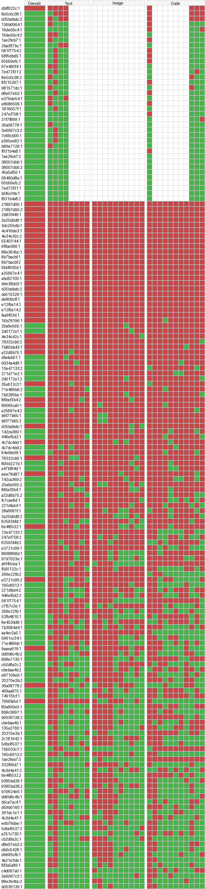

## Experiments and Main Results

### Evaluation datasets and protocol

ARC-AGI-2 provides multiple evaluation sets (public, semi-private, private), all calibrated and evaluated under **pass@2** [@arcprize2024report].

ARC Prize Verified results are reported on the **semi-private evaluation set** via an official verification process and leaderboard.

**Development data disclosure:** The solver was iteratively designed using both the 1,000-task training set and the 120-task public evaluation set; final configuration tuning (modality mix, candidate counts, judge settings) was performed against the public evaluation split. The semi-private evaluation was run on held-out tasks unseen during development, and the resulting ~3 percentage-point gap (76.11% public vs 72.9% semi-private) suggests limited overfitting to the public split. Additionally, the same system was run on ARC-AGI-1's semi-private evaluation set (achieving 94.5%^[ARC-AGI-1 result verified via the ARC Prize evaluation infrastructure: https://arcprize.org/leaderboard]) with **no exposure** to ARC-AGI-1 tasks during design — a fully blind evaluation that further validates generalization.

### Metrics

I report:

- **Accuracy (pass@2)**: the mean per-task solve rate, where each task's solve rate is the fraction of its test instances answered correctly within two guesses. For tasks with a single test instance this is binary (0 or 1); for multi-instance tasks it can be fractional (e.g., 0.5 if one of two test instances is solved). This is distinct from the *instance-level* accuracy (fraction of individual test instances solved), which is reported separately in the per-instance analyses below.
- **Cost per task ($/task)**: total runtime API cost divided by number of tasks (including candidate generation + judging + tool calls + retries as applicable).

### Headline results

#### Timeline

The solver was submitted to the ARC Prize foundation on **December 15, 2025**. Official results were announced on **February 3, 2026**. The leaderboard snapshot in Table 2 reflects the state at the time of announcement; subsequent entries (discussed below) have since been added.

#### Semi-private evaluation (ARC Prize Verified / leaderboard)

My solver achieves:

- **72.9% solved** on ARC-AGI-2 semi-private eval (≈73%) at **$38.99/task** — the highest score on the ARC Prize Verified leaderboard at the time of writing.

For context, the next two leaderboard entries at the time of the results announcement are:

- **GPT-5.2 Pro**: 54.2% at $15.72/task
- **Gemini 3 Pro**: 54.0% at $30.57/task

#### Public evaluation (self-run)

On the public eval set, my solver achieves:

- **76.11% solved** at **$19.69/task** (self-measured).

For the per-instance analysis in Section 6.6, the public evaluation split contains **120 task IDs** with **167 test instances** (75 tasks with 1 test instance, 43 with 2, and 2 with 3).

ARC Prize notes that, in principle, calibrated public/semi-private/private eval sets should be comparable when systems are not overfit [@arcprize2024report]. The ~3 percentage-point gap between public (76.11%) and semi-private (72.9%) likely reflects three factors: (i) natural generalization loss to a held-out task distribution, (ii) the semi-private verification uses OpenAI's zero-data-retention (ZDR) API mode, which disables function/tool calling, and (iii) the semi-private run coincided with a period of known instability in OpenAI's API, resulting in high failure rates and extensive retries that degraded both cost and effective candidate coverage. In this configuration, the tool-integrated code generation candidates (Section 4.4) were replaced with one-shot code generation (no iterative sandbox execution). Code candidates were still produced, but without the iterative debugging loop that makes tool-integrated generation more robust on complex tasks. Since tool-integrated code generation accounts for the bulk of the Code family's cost (Table 7), the ZDR constraint both reduced accuracy and changed the cost profile of the semi-private run relative to the public run.

**Table 2. Leaderboard snapshot and reference systems.**^[https://arcprize.org/leaderboard] Semi-private results are as reported on the ARC Prize Verified leaderboard at the time of the official results announcement (February 3, 2026); the public-evaluation row is self-measured on the public evaluation split.

| AI System | Author | ARC-AGI-2 | Cost/Task | Comment |
| --- | --- | --- | --- | --- |
| Human Panel | Human | 100.00% | $17.00 | At least two humans out of ~400 solved it |
| This paper | Johan Land | 72.90% | $38.99 | Semi-private (official) |
| This paper | Johan Land | 76.11% | $19.69 | Public eval |
| GPT-5.2 Pro (High) | OpenAI | 54.20% | $15.72 |  |
| Gemini 3 Pro (Refine.) | Poetiq | 54.00% | $30.57 |  |
| GPT-5.2 (X-High) | OpenAI | 52.90% | $1.90 |  |
| Gemini 3 Deep Think (Preview) | Google | 45.10% | $77.16 |  |
| GPT-5.2 (High) | OpenAI | 43.30% | $1.39 |  |
| GPT-5.2 Pro (Medium) | OpenAI | 38.50% | $8.99 |  |
| Opus 4.5 (Thinking, 64K) | Anthropic | 37.60% | $2.40 |  |
| Gemini 3 Flash Preview (High) | Google | 33.60% | $0.23 |  |

In this snapshot, the system described in this paper achieves substantially higher verified semi-private accuracy than the strongest single-entry commercial baselines (72.9% vs. ~54%), indicating that modality-driven candidate generation combined with long-context judging can move the frontier in capability. The remaining gap to the human panel (100.0% at $17/task) indicates that the benchmark still contains substantial headroom at roughly comparable cost. The accuracy gain over commercial baselines comes at higher cost per task relative to the cheapest entries, reflecting the additional test-time compute spent on multi-candidate search and downstream adjudication. The public-evaluation result (76.11% at $19.69/task) suggests that comparable accuracy can be achieved at materially lower cost on the public split, although comparisons across public vs. semi-private verification regimes should be interpreted cautiously.

#### Temporal nature of results

The ARC-AGI-2 leaderboard is evolving rapidly, and the results reported here should be understood as a snapshot tied to a specific moment in frontier model development. Foundation models are improving at a pace where single-model performance on ARC-AGI-2 can increase substantially between model generations — in some cases nearly doubling from one release to the next. New model releases after the submission deadline (December 15, 2025) have already narrowed the gap between single-model baselines and ensemble approaches like the one described here, at a fraction of the cost.

This trajectory is expected to continue. As base models grow stronger, the marginal value of any fixed ensemble architecture will shift: the same "diverse generation + holistic judging" pattern applied to stronger base models should yield higher accuracy, but the gap between the ensemble and its best single constituent will likely narrow over time. The contribution of this paper is therefore the **architectural pattern** — modality-driven search paired with context-preserving selection — rather than the specific accuracy numbers, which are a product of the models available at the time of submission.

### Efficiency discussion

ARC-AGI-2 explicitly evaluates efficiency; ARC Prize argues cost per task is the most directly comparable efficiency axis across humans and AI systems [@arcprize2024report].

Reported cost per task on both evaluation sets:

- **Semi-private (official):** $38.99/task at 72.9%
- **Public eval (self-measured):** $19.69/task at 76.11%

For comparison, the next-best entries on the leaderboard at the time of writing:

- GPT-5.2 Pro: **$15.72/task** at 54.2%
- Gemini 3 Pro: **$30.57/task** at 54.0%

The roughly 2× cost difference between the semi-private and public runs ($38.99 vs. $19.69) is likely caused by API-level unreliability. Even on the public-eval run, only 2,216 of 14,106 GPT-5.2 API attempts succeeded (84% failure rate due to rate limits, timeouts, and server errors); the semi-private run, executed on ARC Prize's verification infrastructure, likely experienced comparable or worse failure rates, inflating cost through retried calls that did not contribute to the final output. The public-eval cost of **$19.69/task** is therefore a more representative measure of the system's actual compute requirements.

At this cost, the solver is comparable to GPT-5.2 Pro ($15.72/task) while achieving a +21.9 percentage-point accuracy gain (76.11% vs. 54.2%), and is both cheaper and substantially more accurate than Gemini 3 Pro ($30.57/task at 54.0%). A detailed cost breakdown by component for the public-eval run is provided in Section 7.

### Modality contribution and diversity (qualitative)

The final modality mix was selected based on two criteria:

1. **Performance**: raw solve contribution.
2. **Diversity contribution**: uniquely solved tasks that other modalities fail.

Qualitatively:

- GPT dominates **code generation**, with Gemini adding meaningful diversity; Opus codegen behaved largely like a subset and was dropped in the final mix.
- For **image reasoning**, Gemini and GPT behaved differently and were complementary; Opus image reasoning behaved more like a subset.
- Opus was exceptional for **end-to-end text reasoning**, being the sole solver for several tasks via text-only reasoning.

### Modality complementarity and uniqueness (public eval)

To quantify complementarity between candidate-generation methodologies, I evaluate each candidate output against the ground-truth test target and record a per-instance correctness matrix (Figure 4). Rows correspond to test instances (`task_id`, `test_index`) and columns correspond to individual candidate generators (model × modality × configuration). A cell is marked PASS if the candidate output exactly matches the ground truth, and FAIL otherwise. Blank cells indicate that the corresponding candidate generator was not executed for that instance.



Over the 167 public-evaluation test instances, the final system solves **128/167 = 76.65%** at the instance level (pass@2). This is slightly higher than the task-level accuracy of 76.11% reported in Table 2, because partially solved multi-instance tasks pull the task-level average below the raw instance rate. Of 120 tasks, 86 are fully solved (all instances correct), 11 are partially solved (at least one but not all instances correct), and 23 have no correct instances. The candidate pool contains at least one correct output for **144/167 = 86.23%** of instances (candidate-oracle accuracy). The 39 unsolved instances therefore decompose into:

- **22/167 (13.17%)** instances where no candidate in the pool is correct (candidate-generation failures).
- **17/167 (10.18%)** instances where at least one correct candidate exists but is not selected (selection/judging failures).

Notably, there is one instance where the final system output is correct despite **zero** candidates matching the ground truth (`21897d95:2`); this occurs via judge synthesis (Section 6.7), where the judge recombines partial insights from multiple flawed candidates to produce a novel correct output.

I operationalize modality-level uniqueness by grouping candidate generators into three families: **Text** (including Deep), **Image**, and **Code**. An instance is counted as solvable by a family if any candidate within that family is correct. As described in Section 3, the solver uses adaptive early stopping: when early-stage candidates show strong agreement, the system skips remaining modalities to save cost. This means 37 instances were evaluated with only 8 candidates (the initial Text + Code probe) rather than the full 29. Of these 37 early-stopped instances, **36 were solved correctly** (97.3% accuracy), compared to 92/130 (70.8%) for full-coverage instances. Only one early-stopped instance (`dbff022c:1`, https://arcprize.org/play?task=dbff022c) was incorrectly solved — a case of extreme groupthink. The task itself is relatively simple, but the test case introduces a new mechanic with two valid interpretations: the legend that maps symbols to colors is either "the same" as in training or "inverted." All models confidently assume the simpler interpretation ("legend is the same"), while the ground truth requires the more complex one ("legend is inverted"). This is arguably an artificial source of difficulty — the ambiguity is not clearly disambiguated by the training examples — but it illustrates a characteristic challenge of ARC: test cases can introduce subtle twists that render the majority hypothesis wrong, and no amount of additional candidates would help when every model makes the same simplifying assumption. This high accuracy rate (36/37) validates the early-stopping heuristic, but only for the easiest tasks — which are precisely the tasks that trigger early stopping. On harder tasks, candidates do not converge, early stopping is not triggered, and the full 29-candidate budget is spent. It is on these harder tasks that the system's core contributions — modality diversity and holistic judging — become essential, because majority voting systematically fails when the correct solution is a minority hypothesis (Section 5, Section 7).

To avoid conflating uniqueness with conditional execution, I restrict the modality-level analysis below to the **130 instances with complete candidate coverage** (29/29 candidate columns filled).

**Table 3. Pairwise non-overlap between modality families on the complete-coverage subset (n = 130).** Each cell reads "row solves, column does not": the entry counts instances with at least one PASS in the row family and zero PASS in the column family. The table is not symmetric.

| | Text | Image | Code |
| --- | --- | --- | --- |
| Text | NA | 13 | 7 |
| Image | 17 | NA | 11 |
| Code | 18 | 18 | NA |

**Table 4. Exclusive coverage on the complete-coverage subset (n = 130).** An instance is exclusive to a family if that family has at least one PASS and the other two families have zero PASS.

| Family | Count |
| --- | --- |
| Text only | 2 |
| Image only | 6 |
| Code only | 7 |

Taken together, Tables 3–4 indicate substantial complementarity between modality families: each family covers a non-trivial set of instances that are not covered by at least one of the other families, and exclusive coverage persists even when all candidates are generated. This supports treating modalities as distinct search operators rather than relying on a single representation.

Beyond these aggregate counts, Figure 4 exhibits pronounced *instance-level heterogeneity*: some tasks are solved reliably by one family while being largely unsolved by others. For example, task `a6f40cea` (https://arcprize.org/play?task=a6f40cea) is solved by **7/10** Image candidates, **1/8** Text candidates, and **0/11** Code candidates on its test instance. Qualitatively, the underlying rule resembles a localized magnification or "lens" operation (identifying a small region and "zooming" it), which is naturally expressed and discovered in pixel space. Conversely, task `13e47133` (https://arcprize.org/play?task=13e47133) is solved *only* by Code candidates on both of its test instances (Text = 0/8, Image = 0/10, Code = 7/11 and 2/11, respectively). In this case, the solution is readily implemented by explicitly traversing the boundary/edge structure, a representation that is directly available to code-based generators but comparatively indirect for pure text or visual prompt-based reasoning.

### Judging and synthesis (public eval)

#### Judge-based selection (excluding synthesis)

Judging (excluding synthesis) had a net uplift of **7** instances that were solved relative to a majority-vote baseline (selecting the most common candidate output). All 7 are minority recoveries — cases where the correct answer was not the majority output and the holistic judge identified it by reasoning over the full traces. One example of this is `dfadab01:1` (https://arcprize.org/play?task=dfadab01). This problem heavily suffers from "group think": 12 of the candidate solvers converge on the same incorrect output, and another 8 converge on a second incorrect output. Only one candidate solver produces the correct output. The judges identify the originality in this lone solution and select it. The judge rationale emphasizes that most candidates recover the same underlying stamp mechanic, and that the remaining uncertainty is restricted to edge handling:

```text
Most candidate solvers correctly identify the
core stamp mechanic:
...
I prefer solutions that do *not* stamp at (9,8)
(e.g., solutions 10-15/17-20) over those that
stamp every 8.

The only remaining ambiguity is edge handling
(not clearly disambiguated by the training set):
- Some solvers assume a stamp must fit fully
  (ignore row 17 markers).
- Others assume stamps are clipped at the border
  (row 17 markers produce the top 3 rows of
  the tile).

So the two most plausible outputs
(same mechanic, differing only in border handling)
```

The judge correctly identifies that the core mechanic is not in dispute — all candidates agree on the stamp logic — and reasons that the real ambiguity lies in edge handling, which the training examples do not disambiguate. Rather than committing both guesses to the majority interpretation, the judge uses the pass@2 format to hedge: it selects one output for each interpretation of the border behavior, ensuring that the correct answer is captured regardless of which edge-handling rule the ground truth expects. This is precisely the kind of reasoning that majority voting cannot perform — it requires understanding *where* the uncertainty lies and deliberately including a minority hypothesis to cover it.

#### Judge synthesis

The judge is permitted to output a **synthesized** solution that is not identical to any single candidate output (Section 5.3). On the public evaluation run summarized in Figure 4, synthesis was invoked **17** times total across all three judges. Relative to an ablation that disables synthesis (i.e., forces selection among non-synthesized candidates), synthesis yields an uplift of **1** additional solved instance.

The single instance solved via synthesis is `21897d95:2` (https://arcprize.org/play?task=21897d95) — a particularly difficult task where **none** of the 29 candidates produced a correct output for this test instance. The task requires identifying "rooms" in the grid separated by boundaries, recognizing T-shaped arrows that encode directional recoloring instructions, and applying these instructions across room boundaries. The judge synthesized a correct output by recombining partial insights from multiple flawed candidates — identifying which candidates correctly parsed the room structure, which correctly interpreted the arrow semantics, and which correctly handled the recoloring — even though no single candidate got the full chain right. Below is an excerpt from the judge's synthesis rationale:

```text
--- COUNCIL OF JUDGES SYNTHESIZED SOLUTION ---
Across the training examples, the only solutions that
consistently match the *actual* structure are SOLUTION 1
and SOLUTION 2 (they are the same). They correctly
identify the key mechanic:

- The input is divided into large "rooms" (rectangular
  regions of a dominant background color).
- Inside rooms, color 1 forms a 4-cell T-shape arrow
  (a 3-long bar + 1-cell stem).
- The stem direction indicates which neighboring room
  is the target.
- The paint color is:
  - the center of the 3-long bar if it is not 1
    (a payload color), otherwise
  - the background color of the room containing
    the arrow.
...
the same room recoloring but then rotated 90 CCW.
This is much less likely given the square training
examples, but it matches the extra rotation behavior
seen in the non-square examples and is the most
plausible "geometry variant" if a solver applied
that step unconditionally
...
```

This example illustrates the core value proposition of synthesis: on tasks where the reasoning chain is too long for any single candidate to get right, the judge can act as a meta-reasoner that assembles the correct solution from complementary fragments. The current implementation remains under-optimized; further work on synthesis gating (Section 9) could increase the realized uplift, particularly on harder tasks where this recombination mechanism has the most potential.


### Failure analysis (public eval)

Of the 39 unsolved test instances, 21 are **generation failures** (no candidate in the pool is correct), 17 are **selection failures** (at least one correct candidate exists but is not selected by the judge), and 1 (`dbff022c:1`) is an **early-stopping failure** discussed in Section 6.6 — that instance was stopped after 8 candidates due to apparent consensus, so image and most code candidates were never generated, and it cannot be classified as a generation failure across all modalities. This section lists the generation and selection failure groups to support qualitative analysis of what makes these instances hard.

#### Generation failures (21 instances)

The following instances have zero correct candidates across all modalities (with full 29-candidate coverage). These represent tasks where the system's hypothesis space — across text, image, and code — does not contain the ground-truth transformation.

Many of these tasks appear to require **long chains of dependent reasoning steps**, where the correct solution emerges only after composing multiple sub-concepts in sequence. Each step narrows the interpretation space, but models tend to collapse or shortcut the chain rather than faithfully executing all steps. Three illustrative examples:

- **`3dc255db`** (https://arcprize.org/play?task=3dc255db) requires recognizing "spaceships" with distinct inner and outer regions and a directional front; the outer areas are preserved while inner areas lengthen the front, with the inner/outer distinction determined by the longest edge. This involves at least four dependent inferences (shape identification, region segmentation, directional semantics, and edge-length-based classification).
- **`88e364bc`** (https://arcprize.org/play?task=88e364bc) requires interpreting a legend that encodes movement directions, then simulating movement that respects borders and colors, across multiple independently placed legend entries and areas. The combination of legend parsing, spatial simulation, and multi-region generalization defeats all modalities.
- **`d35bdbdc`** (test 2, https://arcprize.org/play?task=d35bdbdc) involves identifying a path structure, distinguishing inner from outer colors, deleting non-path elements, and recursively transferring colors — with shapes that vary in form across instances.

These examples suggest that the system's candidate generators can sometimes identify individual sub-concepts but struggle to compose the full chain correctly. This is consistent with known limitations of LLM reasoning on deeply compositional tasks, and points to a potential benefit of multi-step decomposition approaches — though Section 8 documents that naive decomposition strategies reduced diversity in practice.

| Task | Test | Link |
| --- | --- | --- |
| `21897d95` | 1 | https://arcprize.org/play?task=21897d95 |
| `2b83f449` | 1 | https://arcprize.org/play?task=2b83f449 |
| `3a25b0d8` | 1 | https://arcprize.org/play?task=3a25b0d8 |
| `3dc255db` | 1 | https://arcprize.org/play?task=3dc255db |
| `4c416de3` | 1 | https://arcprize.org/play?task=4c416de3 |
| `4e34c42c` | 2 | https://arcprize.org/play?task=4e34c42c |
| `5545f144` | 1 | https://arcprize.org/play?task=5545f144 |
| `6ffbe589` | 1 | https://arcprize.org/play?task=6ffbe589 |
| `88e364bc` | 1 | https://arcprize.org/play?task=88e364bc |
| `8b7bacbf` | 1 | https://arcprize.org/play?task=8b7bacbf |
| `8b7bacbf` | 2 | https://arcprize.org/play?task=8b7bacbf |
| `9bbf930d` | 1 | https://arcprize.org/play?task=9bbf930d |
| `a25697e4` | 1 | https://arcprize.org/play?task=a25697e4 |
| `abc82100` | 1 | https://arcprize.org/play?task=abc82100 |
| `b9e38dc0` | 1 | https://arcprize.org/play?task=b9e38dc0 |
| `d35bdbdc` | 2 | https://arcprize.org/play?task=d35bdbdc |
| `da515329` | 1 | https://arcprize.org/play?task=da515329 |
| `de809cff` | 1 | https://arcprize.org/play?task=de809cff |
| `e12f9a14` | 1 | https://arcprize.org/play?task=e12f9a14 |
| `e12f9a14` | 2 | https://arcprize.org/play?task=e12f9a14 |
| `faa9f03d` | 1 | https://arcprize.org/play?task=faa9f03d |

#### Selection failures (17 instances)

The following instances have at least one correct candidate, but the holistic judge fails to select it. These represent cases where the judge's selection mechanism leads to an incorrect final output.

A qualitative observation across several selection failures is that the **test instance introduces a new mechanic or configuration not fully disambiguated by the training examples**, creating genuine ambiguity about the correct generalization. In these cases, some candidates make the right assumptions about how the rule extends, but the judge — reasoning from the same ambiguous training pairs — tends to favor the majority interpretation. Two illustrative examples:

**`36a08778`** (test 2, https://arcprize.org/play?task=36a08778): The training examples establish a straightforward "water flows downward" mechanic. Test 2 introduces walls that block flow — a new structural element not present in training. Most candidates (and the judge) converge on the simpler mechanic, discarding the minority candidates that correctly handle walls:

```text
Most of the 29 solvers converged to the *same* mechanic (and the same output)
...
I discarded outliers like **Solution 2** and **Solution 1**
```

**`88bcf3b4`** (test 2, https://arcprize.org/play?task=88bcf3b4): Training examples show a single "rope/snake" component moving in one direction. Test 2 introduces multiple strings moving in multiple directions — a generalization the training pairs do not disambiguate. The judge identifies the ambiguity but cannot resolve it, and selects the wrong resolution:

```text
From the 5 training examples, the consistent mechanic is **not** "gravity" or
"attraction" of whole blobs. Instead, one non-background component acts like a
**rope/snake**
...
The main ambiguity the examples do *not* disambiguate is what happens when the
"returning" segment reaches the pole's column/row again:
- **Solution 20** continues the diagonal return even after hitting the pole's
  column (so it can pass "through" and go beyond).
- **Solution 16** effectively **clamps** once aligned with the pole's column
  (keeps going straight instead of overshooting).
```

This failure mode is structurally difficult for the holistic judge: when training examples are consistent with multiple generalizations and the test instance is the only signal that distinguishes them, the judge faces the same underspecification that makes the task hard in the first place. The judge's tendency to favor majority-cluster agreement — which is beneficial on tasks where the majority is correct (e.g., `dfadab01:1` in Section 6.7) — becomes a liability on tasks where the correct generalization is a minority hypothesis precisely because it requires handling a novel test-time mechanic.

| Task | Test | Link |
| --- | --- | --- |
| `16b78196` | 1 | https://arcprize.org/play?task=16b78196 |
| `35ab12c3` | 1 | https://arcprize.org/play?task=35ab12c3 |
| `36a08778` | 2 | https://arcprize.org/play?task=36a08778 |
| `4c7dc4dd` | 1 | https://arcprize.org/play?task=4c7dc4dd |
| `4e34c42c` | 1 | https://arcprize.org/play?task=4e34c42c |
| `6e4f6532` | 1 | https://arcprize.org/play?task=6e4f6532 |
| `7666fa5d` | 1 | https://arcprize.org/play?task=7666fa5d |
| `78332cb0` | 1 | https://arcprize.org/play?task=78332cb0 |
| `78332cb0` | 2 | https://arcprize.org/play?task=78332cb0 |
| `7b80bb43` | 1 | https://arcprize.org/play?task=7b80bb43 |
| `88bcf3b4` | 2 | https://arcprize.org/play?task=88bcf3b4 |
| `89565ca0` | 1 | https://arcprize.org/play?task=89565ca0 |
| `9aaea919` | 1 | https://arcprize.org/play?task=9aaea919 |
| `a32d8b75` | 1 | https://arcprize.org/play?task=a32d8b75 |
| `d35bdbdc` | 1 | https://arcprize.org/play?task=d35bdbdc |
| `e3721c99` | 2 | https://arcprize.org/play?task=e3721c99 |
| `eee78d87` | 1 | https://arcprize.org/play?task=eee78d87 |

---
