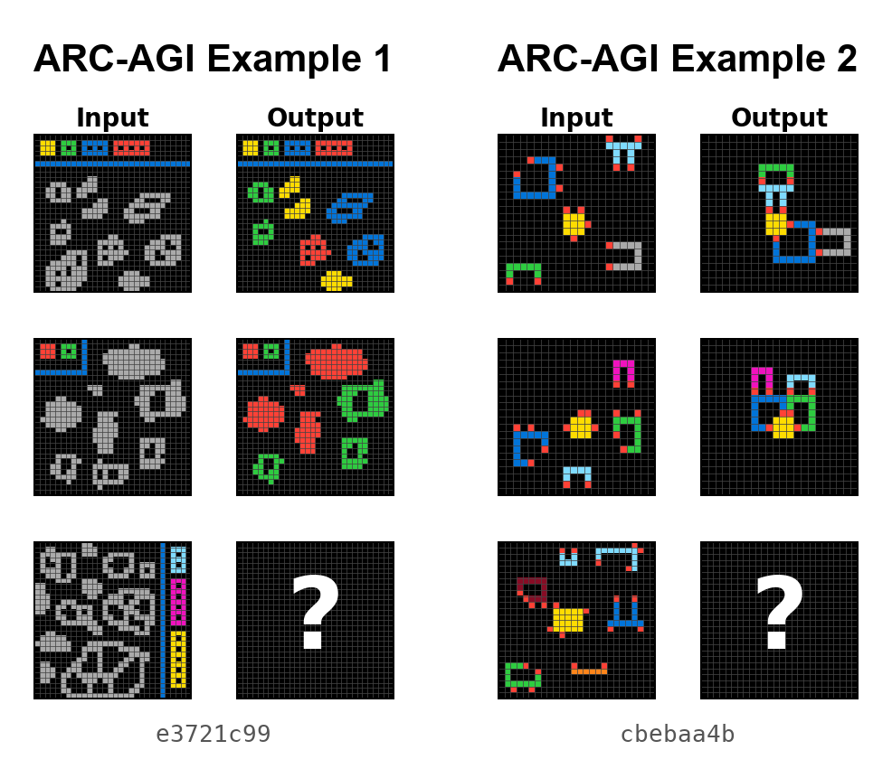
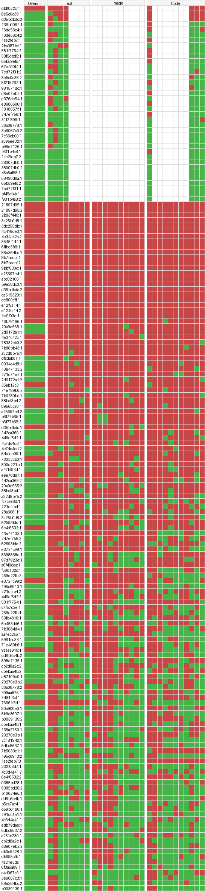

# ARC-AGI-2 — a brief history, and two example problems

:::: {.columns}
::: {.column width="32%"}
**History of ARC-AGI**

- **2019** — ARC-AGI-1 introduced (Chollet)
- **2020–2023** — Program synthesis era (Icecuber et al.); top scores creep up to ~20% on ARC-AGI-1
- **Dec 2024** — OpenAI o3 saturates ARC-AGI-1: ~76% at $200/task
- **2025** — ARC-AGI-2 launches: harder + cost-weighted; top frontier models ~50%
- **Dec 2025** — **This work submitted: 72.9% on ARC-AGI-2**, first verified >70%
- **2026** — Frontier models leapfrog to ~80%+ on ARC-AGI-2 (GPT-5.5, Gemini 3 Deep Think); ARC-AGI-3 launched (top scores still <1%)
:::
::: {.column width="68%"}

:::
::::

::: notes
This is a sampler — three additional ARC-AGI-2 tasks so the audience sees that the benchmark is not one trick. Don't try to solve any of these out loud — that eats too much time. Just point at each in turn (~5 seconds each) and characterize them briefly: "shapes colored by a legend," "objects completed or repaired," "objects aligned across backgrounds." Land the punchline: every task has a fresh rule the model has never seen. You have ~40 seconds total for this slide before moving on to the formal definition on the next slide.
:::

---

# What is ARC-AGI-2? — format and evaluation

:::: {.columns}
::: {.column width="52%"}
**What the model sees (JSON):**

```
{
  "train": [
    {"input":  [[0,1,0],[1,0,1],[0,1,0]],
     "output": [[1,0,1],[0,1,0],[1,0,1]]},
    {"input":  [...], "output": [...]},
    ...
  ],
  "test": [
    {"input":  [[1,0,1],[0,1,0],[1,0,1]]}
  ]
}
```

**What the model returns:**

```
[[0,1,0],[1,0,1],[0,1,0]]
```
:::
::: {.column width="48%"}
- **pass@2:** the model is allowed *two guesses* per test input — scores if either matches
- **Public eval** for development; the **private eval** is the official scoring, run end-to-end by the ARC Prize foundation on tasks the developer never sees
- **Cost per task** (USD) is graded alongside accuracy — efficiency is a first-class metric
:::
::::

::: notes
This slide formalizes the protocol. The JSON example shows the audience exactly what the model receives — a list of train pairs and a test input — and what it returns (a grid). Don't read the JSON line-by-line; just point at it. The right column carries the load: pass@2, the public-vs-private split, and cost-as-metric. Emphasize that the official scoring is done end-to-end by the foundation on tasks the developer never sees — this is what makes the benchmark hard to game.
:::

---

# The headline result: +18.7 pts over the strongest standalone frontier model

| System | ARC-AGI-2 | Cost/Task |
|--------|----------:|----------:|
| Human Panel | 100.0% | $17.00 |
| **This work (semi-private)** | **72.9%** | $38.99 |
| **This work (public eval)** | **76.1%** | $19.69 |
| GPT-5.2 Pro (High) | 54.2% | $15.72 |
| Gemini 3 Pro (Refine.) | 54.0% | $30.57 |
| Opus 4.5 (Thinking, 64K) | 37.6% | $2.40 |

::: notes
Anchor early — audience now knows there's a real result behind the method talk. Be honest about cost: this spends more than a single model call. The contribution is the architectural pattern, not the absolute leaderboard number — those move weekly. Pivot to the next slide with the question: how does an orchestration system beat a frontier model by 18 points?
:::

---

# The real problem is selection, not generation

- LLMs produce fluent, internally coherent traces — and are still **confidently wrong**
- On hard tasks, models **cluster around the same wrong interpretation**
- ⇒ majority voting / self-consistency *amplifies* the error
- The hard problem isn't generating a correct candidate
- It's **recognizing** one when most others disagree

::: notes
This is the reframe that unlocks the whole architecture. If they take only one thing home before the method, take this one. Concrete number to drop: of our 39 failure instances, only 21 are genuine generation failures — 17 are *selection* failures where a correct candidate exists in the pool but is not chosen. Set up the next slide: if the correct answer is rare, we need to (a) make sure we generate it, and (b) recognize it without majority-counting.
:::

---

# Core idea: modalities as search operators

Same task, three representations → three different hypothesis distributions

- **TEXT** — model reads the grid as numbers / strings
- **IMAGE** — model sees a rendered PNG of the grid
- **CODE** — model writes Python to transform the grid

\

- Each modality solves tasks the others miss
- Generate **independently** — don't pool prompts, don't share scaffolding
- Diversity at the *representation* level, not just temperature

::: notes
This is the slide the audience should remember. Slow down. Use the word "operator" deliberately — frame it like classic AI search: each modality expands a different part of the hypothesis space. Concrete intuition: a model reading grids as numbers may notice arithmetic patterns vision misses; a code-writing pass forces a constructive rule the others can leave implicit. Promise the demo on slide 8.
:::

---

# Pipeline overview

:::: {.columns}
::: {.column width="60%"}

:::
::: {.column width="40%"}
**Generate broadly → judge → vote weighted**

- Up to 29 candidates across Text / Image / Code
- 3 frontier models: GPT-5.2, Gemini 3, Opus 4.5
- 3 parallel judges read *all* traces in one long-context prompt
- Early-stop: 37/167 stopped after first probe; **36 correct (97%)**
:::
::::

::: notes
One pass through the diagram, max 50 seconds. Audience just needs the shape. Highlight: judges see *full reasoning traces*, not just final answers — this is what enables minority recovery. Mention early-stop to pre-empt the obvious cost objection.
:::

---

# Candidate generation in practice

- **3 models:** GPT-5.2 (x-high), Gemini 3 Preview (high), Claude Opus 4.5 (long-context)
- **3 modality families:** Text, Image, Code
- **29 candidates per task** across families × configurations
- **Deliberately minimal prompts** in every lane *(see slide 10)*
- Code candidates use a sandbox REPL for iterative debugging

::: notes
Don't list every configuration — the point is the structure: three families crossed with three models. The "minimal prompts" bullet is a callback you'll cash in on the negative-results slide.
:::

---

# Holistic judging vs. majority voting

- Concatenate all 29 reasoning traces into one long-context judge prompt
- Each judge picks top-2 candidates *and* explains why other clusters are wrong
- Weighted vote across 3 judges → pass@2 guesses

**Net uplift vs. majority-vote baseline: +7 instances**

*All 7 are minority recoveries — the correct answer wasn't the most common candidate.*

Plus **+1 synthesis** instance (`21897d95:2`): zero correct candidates — judge recombined partial insights into a novel correct output.

::: notes
The +7 number is the empirical payoff of the architecture. Say it slowly. The synthesis case is *qualitatively* different — it shows the system can sometimes *construct* a correct answer rather than just *select* one. Rare (n=1) but a proof-of-possibility for compositional repair. If time allows, quote the judge rationale from dfadab01:1: "Some solvers assume a stamp must fit fully. Others assume stamps are clipped at the border…" — shows the judge reasoning about disagreement explicitly.
:::

---

# End-to-end walkthrough: `d35bdbdc`

From 29 candidates → 2 guesses


::: notes
This is the pedagogical heart of the talk. Don't rush. Budget 2:30.

Script:
(0:30) Show the task; let the audience attempt it mentally.
(0:30) Show what TEXT candidates produce — note the dominant (wrong) interpretation.
(0:30) Show what IMAGE candidates produce — note where they diverge from Text.
(0:30) Show what CODE candidates produce — note any structurally different hypothesis.
(0:30) Reveal the judge's reasoning: which cluster it rejected, which minority it elevated, why pass@2 lets it hedge.

If tight on time, drop the IMAGE step and go Text → Code → Judge — the contrast is sharpest there. End with: "This is what 'modalities as search operators' looks like in practice."
:::

---

# Modality complementarity

:::: {.columns}
::: {.column width="55%"}

:::
::: {.column width="45%"}
- Pairwise non-overlap (n=130): Code solves 18 that Text misses; Image solves 13 that Text misses
- Exclusive: **2 Text-only**, **6 Image-only**, **7 Code-only**
- Modalities are **not redundant copies** of the same reasoning process
- Candidate-oracle accuracy: **86.2%** (correct candidate exists for 144/167)
:::
::::

::: notes
The oracle number (86.2%) is the most honest framing of the system's ceiling: it says generation is in good shape and selection is the next frontier. Tie back: of the 39 failures, 17 are selection — that's where the headroom is.
:::

---

# Negative results worth knowing

**Prescriptive prompting degrades performance**

Structured templates, CoT scaffolding, domain heuristics — all hurt on the hardest tasks. Mechanism: a *compliance tax on reasoning*.

**Iterative refinement reduces diversity**

Refining candidates against each other collapses them onto the same wrong cluster — the exact failure mode we're trying to escape.

⇒ **Final system: deliberately minimal prompts + independent generation**

::: notes
Most counter-intuitive findings in the paper — audiences love negative results because they save them time. Frame these as design constraints we discovered the hard way: every time we added "helpful" structure, scores dropped on the tasks that mattered.
:::

---

# Takeaways

1. **Modalities are search operators.**
   Text, image, code activate different hypothesis distributions — exploit that.

2. **Holistic judging > majority voting.**
   On hard tasks the truth is a minority hypothesis; let a long-context judge read full traces.

3. **Less prompt structure, more representational diversity.**
   Prescriptive scaffolding suppresses the creative leaps these tasks reward.

Code: `github.com/beetree/ARC-AGI` • Paper QR on title slide

::: notes
Close on the three-bullet recap. Then invite questions. If asked about cost, jump to backup slide on cost breakdown. If asked about failure modes, jump to backup slide on failure decomposition. If asked why three judges, jump to the third backup slide.
:::

---

# Backup: cost breakdown

- **Public-eval cost is the representative number: $19.69/task**
- Semi-private $38.99/task inflated by GPT-5.2 API instability (84% failure rate, 2,216/14,106 attempts succeeded)
- Tool-integrated code generation is the largest line item
- ZDR mode used in semi-private verification disables tool calls → both lower accuracy and altered cost profile
- ARC-AGI-1 on the same system: 94.5% at $11.40/task — easier tasks early-exit cheaply

::: notes
Backup only. Skip unless asked.
:::

---

# Backup: failure decomposition (167 instances)

- **128 solved (76.6%)**
- 21 generation failures (no correct candidate in pool)
- 1 early-stop failure (`dbff022c:1` — extreme groupthink on a legend ambiguity)
- 17 **selection** failures (correct candidate exists, judge missed it)
- 1 synthesis success (`21897d95:2`)

*Most future headroom is in selection, not generation.*

::: notes
Backup only. Skip unless asked.
:::

---

# Backup: why three judges?

- Single judge is biased toward its own prior
- 3 parallel judges + weighted scoring (2 pts first, 1 pt second) hedges *within* the judging step
- Pass@2 format lets the final output also hedge across two interpretations when judges disagree

::: notes
Backup only. Skip unless asked.
:::
