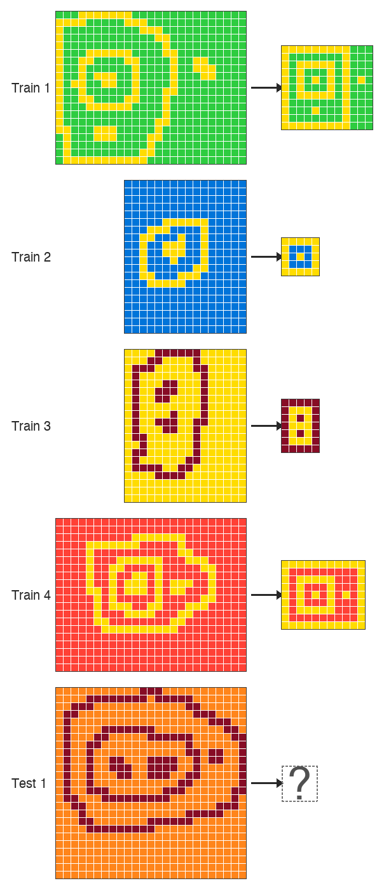

# ARC-AGI-2 — a brief history, and two example problems

:::: {.columns}
::: {.column width="32%"}
- **2019** — ARC-AGI-1 introduced (Chollet); trivial for humans, impossible for AI at the time
- **2020–2023** — Program synthesis era; top scores reach ~20% on ARC-AGI-1
- **Dec 2024** — o3 saturates ARC-AGI-1 (~76% at $200/task), but only ~3% on ARC-AGI-2
- **2025** — Focus shifts to ARC-AGI-2; top scores climb to ~50% (GPT-5.2, Opus 4.5)
- **Dec 2025** — **This work: 72.9% on ARC-AGI-2**, first verified >70%
- **2026** — Frontier models leapfrog to ~80%+ (GPT-5.5, Gemini 3.1 Deep Think, Opus 4.7); ARC-AGI-3 launches (<1%)
:::
::: {.column width="68%"}

:::
::::

::: notes
This is a sampler — three additional ARC-AGI-2 tasks so the audience sees that the benchmark is not one trick. Don't try to solve any of these out loud — that eats too much time. Just point at each in turn (~5 seconds each) and characterize them briefly: "shapes colored by a legend," "objects completed or repaired," "objects aligned across backgrounds." Land the punchline: every task has a fresh rule the model has never seen. You have ~40 seconds total for this slide before moving on to the formal definition on the next slide.
:::

---

# What is ARC-AGI-2? — format and evaluation

:::: {.columns}
::: {.column width="52%"}
**What the model sees (JSON):**

```
{
  "train": [
    {"input":  [[0,1,0],[1,0,1],[0,1,0]],
     "output": [[1,0,1],[0,1,0],[1,0,1]]},
    {"input":  [...], "output": [...]},
    ...
  ],
  "test": [
    {"input":  [[1,0,1],[0,1,0],[1,0,1]]}
  ]
}
```

**What the model returns:**

```
[[0,1,0],[1,0,1],[0,1,0]]
```
:::
::: {.column width="48%"}
- **pass@2:** the model is allowed *two guesses* per test input — scores if either matches
- **Public eval** for development; the **private eval** is the official scoring, run end-to-end by the ARC Prize foundation on tasks the developer never sees
- **Cost per task** (USD) is graded alongside accuracy — efficiency is a first-class metric
:::
::::

::: notes
This slide formalizes the protocol. The JSON example shows the audience exactly what the model receives — a list of train pairs and a test input — and what it returns (a grid). Don't read the JSON line-by-line; just point at it. The right column carries the load: pass@2, the public-vs-private split, and cost-as-metric. Emphasize that the official scoring is done end-to-end by the foundation on tasks the developer never sees — this is what makes the benchmark hard to game.
:::

---

# The headline result: +18.7 pts over the strongest standalone frontier model

| System | ARC-AGI-2 | Cost/Task |
|--------|----------:|----------:|
| Human Panel | 100.0% | $17.00 |
| **This work (private)** | **72.9%** | $38.99 |
| **This work (public eval)** | **76.1%** | $19.69 |
| GPT-5.2 Pro (High) | 54.2% | $15.72 |
| Opus 4.5 (Thinking, 64K) | 37.6% | $2.40 |
| Gemini 3 Pro | 31.1% | $0.81 |

::: notes
Anchor early — audience now knows there's a real result behind the method talk. Be honest about cost: this spends more than a single model call. The contribution is the architectural pattern, not the absolute leaderboard number — those move weekly. Pivot to the next slide with the question: how does an orchestration system beat a frontier model by 18 points?
:::

---

# Two problems: break groupthink, then recognize the outlier

- LLMs produce fluent, internally coherent traces — and are still **confidently wrong**
- On hard tasks, models **cluster around the same wrong interpretation**
- ⇒ majority voting / self-consistency *amplifies* the error
- **(1) Break the groupthink** — diversify so some candidate reaches the correct answer
- **(2) Recognize the rare-correct** — pick it out when most others disagree

*Roadmap: **(1)** next two slides · **(2)** after that · then both wired together · then on a real task*

::: notes
The architecture has to solve two problems, not one. First: counter the groupthink — left to themselves, frontier models cluster on the same wrong interpretation, so the system has to deliberately diversify generation. Second: even when a correct candidate does exist in the pool, majority voting will discard it as an outlier — so selection has to read the reasoning, not just count votes. Concrete number to drop: of our 39 failure instances, 21 are genuine generation failures and 17 are *selection* failures where a correct candidate exists in the pool but is not chosen. The two failure modes are roughly the same size — neither dominates.
:::

---

# (1) Break the groupthink — modalities as search operators

Same task, three representations → three different hypothesis distributions

- **TEXT** — model reads the grid as numbers / strings
- **IMAGE** — model sees a rendered PNG of the grid
- **CODE** — model writes Python to transform the grid

\

- Each modality solves tasks the others miss
- Generate **independently** — don't pool prompts, don't share scaffolding
- Diversity at the *representation* level, not just temperature

::: notes
This is the slide the audience should remember. Slow down. Use the word "operator" deliberately — frame it like classic AI search: each modality expands a different part of the hypothesis space. Concrete intuition: a model reading grids as numbers may notice arithmetic patterns vision misses; a code-writing pass forces a constructive rule the others can leave implicit. Promise the demo on slide 8.
:::

---

# (1) Break the groupthink — candidate generation in practice

- **3 models:** GPT-5.2 (x-high), Gemini 3 Preview (high), Claude Opus 4.5 (long-context)
- **3 modality families:** Text, Image, Code
- **29 candidates per task** across families × configurations
- **Deliberately minimal prompts** in every lane *(see slide 10)*
- Code candidates use a sandbox REPL for iterative debugging

::: notes
Don't list every configuration — the point is the structure: three families crossed with three models. The "minimal prompts" bullet is a callback you'll cash in on the negative-results slide.
:::

---

# (2) Recognize the rare-correct — holistic judging vs. majority voting

- Concatenate all 29 reasoning traces into one long-context judge prompt
- Each judge picks top-2 candidates *and* explains why other clusters are wrong
- Weighted vote across 3 judges → pass@2 guesses

**Net uplift vs. majority-vote baseline: +7 instances**

*All 7 are minority recoveries — the correct answer wasn't the most common candidate.*

Plus **+1 synthesis** instance (`21897d95:2`): zero correct candidates — judge recombined partial insights into a novel correct output.

::: notes
The +7 number is the empirical payoff of the architecture. Say it slowly. The synthesis case is *qualitatively* different — it shows the system can sometimes *construct* a correct answer rather than just *select* one. Rare (n=1) but a proof-of-possibility for compositional repair. If time allows, quote the judge rationale from dfadab01:1: "Some solvers assume a stamp must fit fully. Others assume stamps are clipped at the border…" — shows the judge reasoning about disagreement explicitly.
:::

---

# (1) + (2) wired together — pipeline overview

:::: {.columns}
::: {.column width="60%"}

:::
::: {.column width="40%"}
**Generate broadly → judge → vote weighted**

- Up to 29 candidates across Text / Image / Code
- 3 frontier models: GPT-5.2, Gemini 3, Opus 4.5
- 3 parallel judges read *all* traces in one long-context prompt
- Early-stop: 37/167 stopped after first probe; **36 correct (97%)**
:::
::::

::: notes
One pass through the diagram, max 50 seconds. Audience just needs the shape. Highlight: judges see *full reasoning traces*, not just final answers — this is what enables minority recovery. Mention early-stop to pre-empt the obvious cost objection.
:::

---

# (1) + (2) on a real task — 28 of 29 candidates wrong, judges picked the right one

:::: {.columns}
::: {.column width="40%"}

:::
::: {.column width="58%"}
**Public eval task `2d0172a1:1`** — candidate pool *n* = 29

| Modality family | Correct | Wrong |
|---|:---:|:---:|
| Text (8) | 0 | 8 |
| Image (10) | **1** | 9 |
| Code (11) | 0 | 11 |
| **Total** | **1** | **28** |

> ✅ **Submission verdict: SOLVED** — the holistic judges selected the lone correct candidate.

- One image candidate produced the correct nested-frame output; 28 of 29 candidates were wrong
- Majority voting would collapse onto the wrong cluster
- **Our judges recovered the minority-correct candidate — that's what the submission scored on**
:::
::::

::: notes
A success story. The submission got this task right: 28 of 29 candidates wrong, but the holistic judges identified the one correct image-prompt candidate. Four train pairs all reducing to a nested-frame output determined by the topology of the winding path. Selection layer recovered the rare correct one — what majority voting cannot do. One of the +7 minority recoveries from the holistic-judging ablation.
:::

---

# (2) Recognize the rare-correct — what the judges actually read (`2d0172a1:1`)

This task produced **31,208 lines** of reasoning traces / logs.

:::: {.columns}
::: {.column width="49%"}
**Winning candidate** — GPT-5.2 x-high, image modality

```json
// logs/2026-01-04_22-09-54_2d0172a1_1_step_5.json
{
  "image": {
    ...
    "gpt-5.2-xhigh_13_step_5_image_...": {
      "actual_model": "gpt-5.2-xhigh",
      "input_tokens": 21188,
      "output_tokens": 59323,
      "Full raw LLM response":
"### What the examples show

In every example, the foreground pixels form
several **separate components** of two types:

1. **Frames (loops):** ... every such component
   becomes a **perfect axis-aligned rectangular
   border** (thickness 1).
2. **Markers (solid small components):** ...
   each marker is reduced to a **single
   foreground cell**.
...
### Applying to the test input
- Background color = **7**, foreground = **9**.
- One **outer loop frame**, one **inner loop
  frame** inside it, ... two **markers**
  inside, side-by-side ⇒ **horizontal**.
... outer size **9 rows × 13 columns**.",
      "Extracted grid": [...]
    }, ...
  }, ...
}
```
:::
::: {.column width="49%"}
**Judge's selection rationale** — GPT-5.2 x-high × 3; all 3 picked correctly

```json
// logs/2026-01-04_22-09-54_2d0172a1_1_step_finish.json
{
  ...
  "selection_details": {
    "judges": {
      "duo_pick_council": [
        ..., {
          "model": "gpt-5.2-xhigh",
          "response":
"Across the four solved examples, the
consistent mechanic is **topological
normalization**:
- Each **loop** becomes a **perfect 1-cell-
  thick rectangular frame**.
- Each **solid component** becomes a
  **single foreground cell (a dot)**.
...
The two that best match the examples *and*
the apparent test structure are:
- **Solution 10**: outer frame contains an
  inner frame **plus an extra dot to the
  right** (matching the extra small
  disconnected 9-component at cols ~20–21
  in the test input) ...
- **Solution 6/7**: the same, but **without**
  the extra right-side dot.
### Candidate 1 (most likely): Solution 10",
          "picked_grids": [...]
        }, ...
      ]
    }
  },
  "result": "PASS"
}
```
:::
::::

Raw JSON from the public-eval logs; `"..."` marks elided fields. Judges read *full reasoning* of all 29 candidates ⇒ minority recovery.

::: notes
Payoff slide for the judging architecture. Excerpts are verbatim from the logged run. Left: the winning image candidate reasoned about "frames vs markers" and "topological normalization" — the model's own language, not a forced template. Right: the judge independently arrived at the same mechanic and named the rare-correct candidate "Solution 10" while keeping "Solution 6/7" as the safer pass@2 fallback. Three independent judges all picked the correct grid as #1 — full alignment. The point: the judge does not vote on outputs, it reads the reasoning of all 29 candidates and selects the trace whose argument is most coherent against the training pairs. That's what makes minority recovery possible.
:::

---

# (1) + (2) across 130 tasks — modality contributions and judges' verdicts

:::: {.columns}
::: {.column width="32%"}

:::
::: {.column width="66%"}
**How to read** (one row = one of **130 instances** with full 29-candidate coverage):

- **Judges column** (leftmost): the system's final pass@2 verdict — did the holistic judges submit a correct answer?
- Other columns grouped by modality family — **Text** · **Image** · **Code** — each sub-column = one model/config candidate
- **Green** = correct · **Red** = wrong
- Rows sorted by difficulty: hardest tasks top, easiest bottom

**Three bands tell the story**:

- **Top:** all-red rows — generation failures (no modality solved them)
- **Middle:** *scattered green cells in mostly-red rows* ⇒ different modalities catch different problems
- **Bottom:** mostly green — the easy tasks (many modalities solve)

**Edge case — Judges green, all candidates red**: a *judge-synthesis* solve. Happens on `21897d95:2`: zero candidates correct, but a judge **recombined partial insights** across failed candidates into a novel correct output.

**What the numbers say** (n=130):

- Exclusive solves: **2 Text-only** · **6 Image-only** · **7 Code-only**
- Pairwise non-overlap: Code solves **+18** over Text · Image solves **+13** over Text
- **Candidate-oracle: 86.2%** — a correct candidate exists for 144/167 instances overall
- Modalities are **not redundant copies** of each other
:::
::::

::: notes
The chart is dense — spend the first 20s teaching the audience how to read it. Point at the top band ("look at these rows: green across the board — easy tasks"), then the middle band ("but *here* — mostly red rows with only one or two green cells. That's modality diversity doing the work"), then the bottom ("and these are the generation failures — no modality solved them"). The 86.2% oracle number is the most honest framing of the system's ceiling: generation is in good shape; selection is the next frontier. Tie back: of the 39 failures, 17 are *selection* — that's where the headroom is.
:::

---

# Negative results worth knowing

**1. Prescriptive prompting degrades performance.** Templates, CoT scaffolding, domain heuristics — all hurt on the hardest tasks. Mechanism: a *compliance tax on reasoning* (budget spent following the template instead of solving the problem).

**2. Iterative refinement reduces diversity.** Refining candidates against each other collapses them onto the same wrong cluster — the exact failure mode we're trying to escape. Same effect from hint-then-solve pipelines.

**3. Pipeline decomposition (objects → transformations → solver) hurts.** Brittle handoffs between stages. Both verbose and terse handovers regress toward the mean rather than expand the hypothesis space.

**4. Strict JSON outputs underperform CSV.** Forcing API-level response-format schemas consistently lost to CSV + robust regex parsing. Strict schemas appear to constrain reasoning quality, not just output shape.

**5. Pixel-perfect image renderings hurt.** *Slightly distorted* renders beat pixel-perfect ones for image-modality candidates. Clean renders push the model into cell-by-cell numerical reasoning; intentional imprecision forces engagement with shapes, symmetries, and spatial relationships — which is the point of image prompting.

⇒ **Final system: deliberately minimal prompts, independent generation, no decomposition, CSV I/O, deliberately fuzzy image renders.**

::: notes
Most counter-intuitive findings in the paper — audiences love negative results because they save them time. Frame these as design constraints we discovered the hard way: every time we added "helpful" structure, scores dropped on the tasks that mattered. (1) and (2) are the big two — spend more time there. (3) is a useful counterpoint to anyone who's spent six months building a multi-stage agent. (4) will surprise the LLM-engineering audience used to JSON-mode being a default. (5) is the most visually intuitive — mention that we render the grids with intentional jitter, like a hand-drawn sketch, because pixel-perfect renderings made the model treat the image as a lossless encoding and fall back on numerical reasoning instead of visual.
:::

---

# Takeaways

**(1) Generate broadly** — different modalities (text, image, code) and different frontier models, generated *independently*. The hypothesis space matters more than the model.

**(2) Judge holistically** — a long-context judge reads the *full reasoning*, not just final answers. Majority voting discards the rare-correct; trace-aware judging recovers it (and occasionally synthesizes a new one).

**Where this generalizes:** any hard problem where the *reasoning* signals correctness — even when the answer itself can't be verified directly. As in ARC: the judges never see the test output; they assess the **credibility of each trace** against the training pairs. Math contests, code review, legal arguments, scientific hypotheses — wherever a careful reader can tell sound reasoning from rationalization.

Code: `github.com/beetree/ARC-AGI` · Paper QR on title slide

::: notes
Close strong on the generalization claim. Pause on the headline and let it land. Recap (1) and (2). Key clarification on "where this generalizes": this is *not* only for problems with checkable answers. It also works whenever the reasoning itself carries credible signal — as in ARC, where the judges never see the test output and instead assess each trace's coherence against the training pairs. The audience should think about applying this anywhere a careful reader could tell sound reasoning from rationalization: code review, legal arguments, scientific hypotheses, design critiques. The closing number reminds them this isn't speculative: verified result, almost 20 points over the best standalone model. Then invite questions.
:::

---

# End-to-end walkthrough: `d35bdbdc`

From 29 candidates → 2 guesses


::: notes
This is the pedagogical heart of the talk. Don't rush. Budget 2:30.

Script:
(0:30) Show the task; let the audience attempt it mentally.
(0:30) Show what TEXT candidates produce — note the dominant (wrong) interpretation.
(0:30) Show what IMAGE candidates produce — note where they diverge from Text.
(0:30) Show what CODE candidates produce — note any structurally different hypothesis.
(0:30) Reveal the judge's reasoning: which cluster it rejected, which minority it elevated, why pass@2 lets it hedge.

If tight on time, drop the IMAGE step and go Text → Code → Judge — the contrast is sharpest there. End with: "This is what 'modalities as search operators' looks like in practice."
:::

---

# Backup: cost breakdown

- **Public-eval cost is the representative number: $19.69/task**
- Private $38.99/task inflated by GPT-5.2 API instability (84% failure rate, 2,216/14,106 attempts succeeded)
- Tool-integrated code generation is the largest line item
- ZDR mode used in private verification disables tool calls → both lower accuracy and altered cost profile
- ARC-AGI-1 on the same system: 94.5% at $11.40/task — easier tasks early-exit cheaply

::: notes
Backup only. Skip unless asked.
:::

---

# Backup: failure decomposition (167 instances)

- **128 solved (76.6%)**
- 21 generation failures (no correct candidate in pool)
- 1 early-stop failure (`dbff022c:1` — extreme groupthink on a legend ambiguity)
- 17 **selection** failures (correct candidate exists, judge missed it)
- 1 synthesis success (`21897d95:2`)

*Most future headroom is in selection, not generation.*

::: notes
Backup only. Skip unless asked.
:::

---

# Backup: why three judges?

- Single judge is biased toward its own prior
- 3 parallel judges + weighted scoring (2 pts first, 1 pt second) hedges *within* the judging step
- Pass@2 format lets the final output also hedge across two interpretations when judges disagree

::: notes
Backup only. Skip unless asked.
:::
